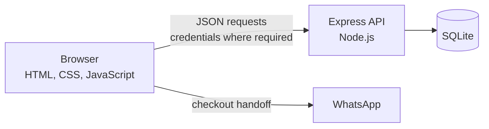

# Sari Rasa — UMKM Culinary Profile

Sari Rasa is a full-stack learning and portfolio application for a local Indonesian culinary business. Customers can browse a bilingual menu, maintain a guest or account-backed cart, and hand an order off to WhatsApp. Authenticated administrators can manage the product catalog.

The currently implemented system uses a vanilla browser frontend, an Express API, and SQLite persistence. A separate local Python learning workspace (`python/`) contains the verified Phase 4A foundation and a small synthetic UMKM transaction dataset for Phase 4B-1 schema exercises. It is not a running service and is not part of the application. Dataset loading, cleaning, analytics, machine learning, deep learning, and AI integration remain future roadmap work; this repository does not present them as current capabilities or claim a production deployment.

## Implemented features

### Menu and frontend

- Products loaded dynamically from the backend and rendered as responsive cards
- Category filters for `Makanan`, `Minuman`, and `Snack`
- Indonesian and English UI with a persisted language preference
- Current product data used for prices, totals, descriptions, and WhatsApp orders

### Authentication and accounts

- Account registration, login, logout, and session restoration
- Signed, HttpOnly cookie authentication
- Database-authoritative user roles and role-aware UI
- Server-side authorization for protected and admin-only operations

### Persistent cart

- Guest cart persistence in `localStorage`
- Account cart persistence in SQLite
- Idempotent guest-to-account cart merge after explicit login
- Quantity and note persistence, including serialized authenticated writes and debounced note updates
- Checkout protection while authenticated changes are not safely persisted
- WhatsApp checkout built from the current cart and product models

### Product administration

- Admin-only product creation, full update, and deletion
- Bilingual descriptions and product image metadata
- Backend validation and database persistence across refreshes

### Engineering quality

- Permanent backend, database, and frontend regression suites
- Isolated temporary SQLite databases and ephemeral backend ports in tests
- Actual `index.html` ↔ `script.js` element contracts
- Frontend ↔ backend API route and method contracts
- Guards that prevent tests from opening the development database directly, through symlinks, or through hard-link aliases
- Combined `npm test` runner with 56 verified tests

## Technology stack

| Area | Technology |
|---|---|
| Frontend | Semantic HTML, CSS, vanilla browser JavaScript, browser `localStorage` and `<dialog>` APIs |
| Backend | Node.js 22+, Express 5, CommonJS |
| Database | SQLite through `better-sqlite3` |
| Authentication and security | bcrypt password hashing, HMAC-signed cookies, HttpOnly/SameSite/Secure cookie controls, CORS, role middleware, in-memory rate limiting |
| Testing | Node's built-in `node:test` and `node:vm`; custom minimal browser fakes; no external test framework |

## Architecture at a glance



The browser owns presentation and guest state. The Express API is authoritative for authenticated identity, authorization, products, and account carts. SQLite persists products, users, authenticated cart items, and merge receipts.

See [Architecture](docs/ARCHITECTURE.md) for component boundaries, security decisions, cart transitions, and test design.

## Quick start

### Prerequisites

- Node.js 22 or later
- npm
- A static frontend server that can serve the repository root at exactly `http://localhost:5500`

Install the locked dependencies:

```sh
npm ci
```

The project does **not** load `.env` files automatically. Generate a random development-only secret in the current shell with the required Node runtime; the command does not print the value:

```sh
export SESSION_SECRET="$(node -e "process.stdout.write(require('node:crypto').randomBytes(32).toString('hex'))")"
```

Do not print, share, or store this value in the repository. Then start the backend with that existing value:

```sh
NODE_ENV=development \
SESSION_SECRET="$SESSION_SECRET" \
npm start
```

An unset, blank, or too-short value fails at startup. Do not substitute a public example string merely because it passes the length check; a predictable signing key is unsafe.

The backend starts at `http://localhost:3000` by default. Check it at `http://localhost:3000/api/health`.

Serve the repository root with VS Code Live Server at `http://localhost:5500`. Live Server is external development tooling and is not installed by `npm ci`; configure its port to `5500` if necessary.

Use `localhost` consistently for both origins. Do not mix `localhost` and `127.0.0.1`, because they are different browser origins and can produce different cookie and CORS behavior.

This is only the shortest supported local path. See the [Local Development Runbook](docs/RUNBOOK.md) for detailed setup, operations, and troubleshooting.

## Environment variables

| Variable | Required | Current behavior |
|---|---|---|
| `SESSION_SECRET` | Yes | HMAC key for signed session cookies. Startup rejects missing, blank, or shorter-than-16-character values. Use a much longer random value and never commit it. |
| `NODE_ENV` | Required for local HTTP authentication | `development` is the only value that disables the cookie's `Secure` flag. Every other value fails closed to `Secure=true`, which requires HTTPS for browser authentication. |
| `DATABASE_PATH` | No for normal runtime | Defaults to `data/umkm.db`. Under `NODE_ENV=test`, an explicit isolated path is mandatory and aliases to the development database are rejected. |
| `PORT` | No | Defaults to `3000`; accepted values are integers from 1 through 65535. |

The backend port is configurable, but the current frontend API base URL is fixed to `http://localhost:3000`. Changing `PORT` alone therefore breaks frontend API communication unless the frontend implementation is changed too.

See [.env.example](.env.example) for additional environment safety notes. Copying it to `.env` does not configure the application because no dotenv loader is installed.

## Testing

Run the complete regression foundation:

```sh
npm test
```

Or run either permanent suite independently:

```sh
npm run test:backend
npm run test:frontend
```

Current verified baseline:

| Suite | Tests | Result |
|---|---:|---|
| Backend and database | 30 | 30 passed |
| Frontend VM and contracts | 26 | 26 passed |
| Combined | 56 | 56 passed |

The backend suite uses Node's built-in test runner, temporary SQLite databases, and ephemeral HTTP ports. It covers authentication, authorization, products, carts, merge idempotency, constraints, cascades, schema evolution, and development-database protection.

The frontend suite loads the actual production `script.js` into `node:vm` with controlled DOM, storage, fetch, and timer boundaries. A test-only probe is appended in memory; production code contains no test hooks. Contract tests also compare the real HTML dependencies and frontend API calls with the backend routes.

These automated suites do not use Playwright, Cypress, Selenium, or a real browser. Real-browser verification was performed separately through user-executed Safari acceptance.

## Project structure

```text
.
├── index.html                  # Page structure and accessible UI controls
├── style.css                  # Responsive presentation
├── script.js                  # Browser state, rendering, auth, cart, and admin UI
├── server.js                  # Express application, routes, and startup seam
├── db/
│   └── database.js             # SQLite connection, schema evolution, and seeding
├── lib/                       # Password, session, user, and rate-limit helpers
├── middleware/                # Authentication, authorization, and rate limiting
├── tests/
│   ├── backend/                 # HTTP and live-database regression tests
│   ├── frontend/                # Production-script VM and contract tests
│   └── helpers/                 # Isolated backend and browser test harnesses
├── docs/
│   ├── ARCHITECTURE.md          # Technical system design
│   └── RUNBOOK.md               # Local setup and operations
├── .env.example               # Environment-variable documentation
├── ROADMAP.md                 # Approved status and future learning roadmap
└── package.json               # Runtime and test commands
```

## Engineering highlights

- **Server-verifiable sessions:** the browser receives an HMAC-signed cookie that JavaScript cannot read. Each protected request also checks the user's current database role and token version.
- **Separated cart authority:** anonymous carts remain browser-local, while authenticated carts are owned and persisted by the server using `req.user.id` rather than client-supplied identity.
- **Retry-safe cart merge:** `(user_id, merge_id)` receipts prevent a repeated login merge from reapplying quantities or notes.
- **Controlled authenticated writes:** per-product serialization, coalescing, note debounce, reconciliation, and auth/cart epochs prevent older work from overwriting newer state.
- **Safe logout and checkout:** required writes drain before logout, account state is not copied into guest storage, and checkout is disabled while authenticated persistence is unsafe.
- **Test-data isolation:** backend tests create disposable databases and reject direct and filesystem-aliased paths to `data/umkm.db` before SQLite initialization.
- **Executable integration contracts:** tests connect production HTML expectations, production frontend requests, and Express route definitions without adding a browser framework.

These controls are appropriate to the current learning project; they are not a claim of enterprise scale or complete production hardening.

## Current status

- Phase 1 — Frontend Foundation: verified complete
- Phase 2 — Backend & API: verified complete
- Phase 3 — Full-Stack Application: verified complete
- Automated Regression Foundation: verified complete
- Project Documentation / Runbook: verified complete
- Quality Gate — Engineering Foundation: verified complete
- Phase 4A-1 — Python Foundation Scaffold: verified complete (foundation-only workspace, not a running service)
- Phase 4A-2 — Core Python Fundamentals & Error Handling: verified complete (list/dict/loop processing, pathlib, and JSON read/write; still foundation-only)
- Phase 4A-3 — Python Foundation Finalization: verified complete (adds a tested `python -m sari_rasa_data` entry point)
- Phase 4A overall: verified complete
- Phase 4B-1 — Dataset Foundation & Schema: verified complete
- Remaining Phase 4 work, machine learning, deep learning, and AI phases: planned future work

See the [Project Roadmap](ROADMAP.md) for the approved phase sequence and current source of truth.

## Detailed documentation

- [Architecture](docs/ARCHITECTURE.md) — components, data flows, trust boundaries, and testing design
- [Local Development Runbook](docs/RUNBOOK.md) — setup, startup, testing, troubleshooting, and safe shutdown
- [Project Roadmap](ROADMAP.md) — verified status and approved future learning direction

## Known operational limitations

- The application is currently oriented around local development, not a documented production deployment.
- Frontend and CORS origins are fixed to `http://localhost:5500`, and the frontend API URL is fixed to `http://localhost:3000`.
- Registration creates normal users; there is no supported admin-provisioning workflow or bundled admin credential.
- There is no supported development-database reset, backup, or recovery command. `data/umkm.db` contains persistent local data and is intentionally ignored by Git.
- Authentication and registration rate limits are in memory and reset when the backend process restarts.
