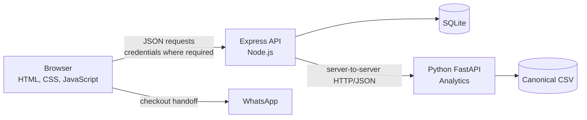

# Sari Rasa — UMKM Culinary Profile

Sari Rasa is a full-stack learning and portfolio application for a local Indonesian culinary business. Customers can browse a bilingual menu, maintain a guest or account-backed cart, and hand an order off to WhatsApp. Authenticated administrators can manage the product catalog.

The currently implemented system uses a vanilla browser frontend, an Express API, and SQLite persistence. A separate local Python workspace contains the analytics pipeline and deterministic next-day quantity forecasting. The dashboard derives compact cached aggregates from the same 750,000-row V2 history used by ML; its 11 products exactly match the application catalog, and raw rows never leave Python. That source spans 693 days and produces only 664 supervised forecasting observations—not 750,000 ML training examples. The Admin Analytics dashboard presents the production HGB next-day forecast and a separate experimental MLP comparison through strictly validated FastAPI → Node gateways. All synthetic data is fictional.

## Implemented features

### Menu and frontend

- Products loaded dynamically from the backend and rendered as responsive cards
- Category filters for `Makanan`, `Minuman`, and `Snack`
- Indonesian and English UI with a persisted language preference
- Current product data used for prices, totals, descriptions, and WhatsApp orders

### Authentication and accounts

- Account registration, login, logout, and session restoration
- Signed, HttpOnly cookie authentication
- Database-authoritative user roles and role-aware UI
- Server-side authorization for protected and admin-only operations

### Persistent cart

- Guest cart persistence in `localStorage`
- Account cart persistence in SQLite
- Idempotent guest-to-account cart merge after explicit login
- Quantity and note persistence, including serialized authenticated writes and debounced note updates
- Checkout protection while authenticated changes are not safely persisted
- WhatsApp checkout built from the current cart and product models

### Product administration

- Admin-only product creation, full update, and deletion
- Bilingual descriptions and product image metadata
- Backend validation and database persistence across refreshes

### Analytics and demand forecast

- Admin sales KPIs, trend, product performance, and category revenue with a shared historical date filter
- Next-day total-demand forecast that always uses the latest trusted history and is independent of that filter
- Inclusive trailing 7- and 28-calendar-day actual-demand averages, neutral comparisons, cutoff/horizon provenance, and transparent limitations
- Independent loading/error/retry behavior, effective-admin lifecycle caching, stale-response protection, responsive layout, accessibility, and Indonesian/English presentation
- Experimental model comparison over the common frozen TEST period: production HGB, experimental PyTorch MLP, and previous-week benchmark

### Engineering quality

- Permanent backend, database, and frontend regression suites
- Isolated temporary SQLite databases and ephemeral backend ports in tests
- Actual `index.html` ↔ `script.js` element contracts
- Frontend ↔ backend API route and method contracts
- Guards that prevent tests from opening the development database directly, through symlinks, or through hard-link aliases
- Combined `npm test` runner with 167 passing tests at the Phase 6-EXT-H quality gate

## Technology stack

| Area | Technology |
|---|---|
| Frontend | Semantic HTML, CSS, vanilla browser JavaScript, browser `localStorage` and `<dialog>` APIs |
| Backend | Node.js 22+, Express 5, CommonJS |
| Python data service | FastAPI and Uvicorn (health, analytics, production forecast, and experimental comparison endpoints) |
| ML/DL development | Pandas/NumPy feature preparation, scikit-learn HGB, and a small CPU PyTorch MLP |
| Database | SQLite through `better-sqlite3` |
| Authentication and security | bcrypt password hashing, HMAC-signed cookies, HttpOnly/SameSite/Secure cookie controls, CORS, role middleware, in-memory rate limiting |
| Testing | Node's built-in `node:test` and `node:vm`; pytest and FastAPI `TestClient` for Python |

## Architecture at a glance



The browser owns presentation and guest state. The Express API is authoritative for authenticated identity, authorization, products, and account carts. SQLite persists products, users, authenticated cart items, and merge receipts.

See [Architecture](docs/ARCHITECTURE.md) for component boundaries, security decisions, cart transitions, and test design.

## 🚀 Local Development Cheat Sheet

| What are you running? | Required processes |
|---|---|
| **Normal website** | Frontend + Node/Express ✅ — Python is not required |
| **Analytics / Forecast** | Frontend + Node/Express + Python FastAPI ✅ |

One-time Node setup from the repository root requires Node.js 22+, npm, and VS Code Live Server:

```sh
npm ci
cp .env.example .env
openssl rand -hex 32
```

Put the generated value in `SESSION_SECRET=` inside `.env`. Never commit `.env` or disclose its values.

### Terminal 1 — Node / Express backend (required)

Working directory: repository root.

```sh
npm start
```

- App/API: `http://localhost:3000`
- Health: `http://localhost:3000/api/health`

### Terminal 2 — frontend (required)

Working directory: repository root.

```text
VS Code → Live Server → Go Live (port 5500)
```

- Website: `http://localhost:5500`

### Terminal 3 — Python FastAPI (Analytics / Forecast only)

Working directory: `python/`. Activate the existing repository-level virtual environment, then start FastAPI:

```sh
source ../.venv/bin/activate
uvicorn sari_rasa_data.service:app --reload --app-dir src
```

- Service: `http://127.0.0.1:8000`
- Health: `http://127.0.0.1:8000/health`

Python is not needed for authentication, admin management, password recovery, email, carts, or ordinary website use. Use `localhost` for both browser-facing processes; do not substitute `127.0.0.1` for the frontend URL.

📖 **Need the full setup, troubleshooting, testing, and maintenance guide?** See [Full Local Development Startup](docs/RUNBOOK.md#full-local-development-startup).

## Environment variables

| Variable | Required | Current behavior |
|---|---|---|
| `SESSION_SECRET` | Yes | HMAC key for signed session cookies. Startup rejects missing, blank, or shorter-than-16-character values. Use a much longer random value and never commit it. |
| `NODE_ENV` | Yes for explicit runtime mode | `production` enables the cookie's `Secure` flag for HTTPS deployments; `development` keeps the signed HttpOnly cookie usable over local HTTP. |
| `DATABASE_PATH` | No for normal runtime | Defaults to `data/umkm.db`. Under `NODE_ENV=test`, an explicit isolated path is mandatory and aliases to the development database are rejected. |
| `PORT` | No | Defaults to `3000`; accepted values are integers from 1 through 65535. |
| `PYTHON_SERVICE_URL` | No | FastAPI base URL used only by Node analytics routes; defaults to `http://127.0.0.1:8000`. |
| `FRONTEND_ORIGIN` | No locally; yes for deployment | Exact trusted browser origin for CORS and protected mutations; defaults to `http://localhost:5500`, and production requires HTTPS. |
| `APP_PUBLIC_ORIGIN` | No locally; yes in production | Trusted origin for reset links; defaults to `FRONTEND_ORIGIN`, never comes from request headers, and requires HTTPS in production. |
| `EMAIL_DELIVERY_MODE` | No locally; yes in production | `disabled` is the non-network local/test default; production requires `resend`. |
| `RESEND_API_KEY` | In `resend` mode | Server-only provider credential; keep it in runtime secrets and never expose or commit it. |
| `EMAIL_FROM` | In `resend` mode | Provider-verified sender address. |
| `EMAIL_FROM_NAME` | No | Sender display name; defaults to `Sari Rasa`. |
| `SARI_RASA_ANALYTICS_DATASET_PATH` | No | Trusted FastAPI analytics CSV path; defaults to generated `python/data/transactions_ml_v2.csv`. Never derive it from a browser request. |
| `SARI_RASA_ML_DATASET_PATH` | No | Trusted V2 forecast/inference CSV path. Defaults to `python/data/transactions_ml_v2.csv`. |
| `SARI_RASA_MODEL_ARTIFACT_PATH` | No | Trusted production HGB joblib path. Defaults to the generated V2 artifact. |
| `SARI_RASA_DL_MODEL_ARTIFACT_PATH` | No | Trusted experimental MLP artifact path. Defaults to ignored `python/models/next_day_quantity_mlp_v1.pt`. |

The backend port is configurable, but the current frontend API base URL is fixed to `http://localhost:3000`. Changing `PORT` alone therefore breaks frontend API communication unless the frontend implementation is changed too.

See [.env.example](.env.example) for the safe local template and additional environment notes. `.env` is intentionally ignored by Git.

## Testing

Run the complete regression foundation:

```sh
npm test
```

Or run either permanent suite independently:

```sh
npm run test:backend
npm run test:frontend
```

Current verified baseline:

| Suite | Tests | Result |
|---|---:|---|
| Backend and database | 72 | 72 passed |
| Frontend VM and contracts | 95 | 95 passed |
| Combined Node suites | 167 | 167 passed |
| Python data/service | 341 | 341 passed |

The backend suite uses Node's built-in test runner, temporary SQLite databases, and ephemeral HTTP ports. It covers authentication, authorization, products, carts, merge idempotency, constraints, cascades, schema evolution, and development-database protection.

The frontend suite loads the actual production `script.js` into `node:vm` with controlled DOM, storage, fetch, and timer boundaries. A test-only probe is appended in memory; production code contains no test hooks. Contract tests also compare the real HTML dependencies and frontend API calls with the backend routes.

These automated suites do not use Playwright, Cypress, Selenium, or a real browser. Real-browser verification was performed separately through user-executed Safari acceptance.

## Project structure

```text
.
├── index.html                  # Page structure and accessible UI controls
├── style.css                  # Responsive presentation
├── script.js                  # Browser state, rendering, auth, cart, and admin UI
├── server.js                  # Express application, routes, and startup seam
├── db/
│   └── database.js             # SQLite connection, schema evolution, and seeding
├── lib/                       # Password, session, user, and rate-limit helpers
├── middleware/                # Authentication, authorization, and rate limiting
├── tests/
│   ├── backend/                 # HTTP and live-database regression tests
│   ├── frontend/                # Production-script VM and contract tests
│   └── helpers/                 # Isolated backend and browser test harnesses
├── docs/
│   ├── ARCHITECTURE.md          # Technical system design
│   ├── ACCOUNT_ADMIN_EXTENSION.md # Detailed Phase 6-EXT contracts and evidence
│   └── RUNBOOK.md               # Local setup and operations
├── .env.example               # Environment-variable documentation
├── ROADMAP.md                 # Approved status and future learning roadmap
├── python/                    # Python data modules, FastAPI service, and pytest suite
└── package.json               # Runtime and test commands
```

## Engineering highlights

- **Server-verifiable sessions:** the browser receives an HMAC-signed cookie that JavaScript cannot read. Each protected request also checks the user's current database role and token version.
- **Separated cart authority:** anonymous carts remain browser-local, while authenticated carts are owned and persisted by the server using `req.user.id` rather than client-supplied identity.
- **Retry-safe cart merge:** `(user_id, merge_id)` receipts prevent a repeated login merge from reapplying quantities or notes.
- **Controlled authenticated writes:** per-product serialization, coalescing, note debounce, reconciliation, and auth/cart epochs prevent older work from overwriting newer state.
- **Safe logout and checkout:** required writes drain before logout, account state is not copied into guest storage, and checkout is disabled while authenticated persistence is unsafe.
- **Test-data isolation:** backend tests create disposable databases and reject direct and filesystem-aliased paths to `data/umkm.db` before SQLite initialization.
- **Executable integration contracts:** tests connect production HTML expectations, production frontend requests, and Express route definitions without adding a browser framework.
- **Separated production and experiment paths:** HGB remains the production forecast; the MLP uses its own validated weights-only artifact, inference function, service route, and explicitly experimental dashboard comparison.

These controls are appropriate to the current learning project; they are not a claim of enterprise scale or complete production hardening.

## Current status

- Phase 1 — Frontend Foundation: verified complete
- Phase 2 — Backend & API: verified complete
- Phase 3 — Full-Stack Application: verified complete
- Automated Regression Foundation: verified complete
- Project Documentation / Runbook: verified complete
- Quality Gate — Engineering Foundation: verified complete
- Phase 4A-1 — Python Foundation Scaffold: verified complete (foundation-only workspace, not a running service)
- Phase 4A-2 — Core Python Fundamentals & Error Handling: verified complete (list/dict/loop processing, pathlib, and JSON read/write; still foundation-only)
- Phase 4A-3 — Python Foundation Finalization: verified complete (adds a tested `python -m sari_rasa_data` entry point)
- Phase 4A overall: verified complete
- Phase 4B-1 — Dataset Foundation & Schema: verified complete
- Phase 4B-2 — CSV/JSON Loading & Validation: verified complete
- Phase 4B-3 — Cleaning & Transformation: verified complete
- Phase 4B-4 — Aggregation & Final Verification: verified complete
- Phase 4B overall: verified complete with a pure-Python local data pipeline
- Phase 4C-1 — Pandas Foundation & DataFrame: verified complete
- Phase 4C-2 — Filtering, Grouping & Aggregation: verified complete
- Phase 4C-3 — NumPy & Basic Statistics: verified complete
- Phase 4C-4 — Analysis Pipeline & Large Synthetic Dataset: verified complete (user manual analysis acceptance passed)
- Phase 4C overall: verified complete
- Phase 4D-1 — FastAPI Foundation & Health Endpoint: verified complete
- Phase 4D-2 — Analytics Summary API: verified complete
- Phase 4D-3 — Products & Categories API: verified complete
- Phase 4D-4 — Error Handling & Final Verification: verified complete
- Phase 4D overall: verified complete (final user manual acceptance passed)
- Phase 4E — Node.js ↔ Python Integration: verified complete (manual integration acceptance passed)
- Phase 4F — Integration & Quality Gate: verified complete
- Phase 4 overall: verified complete
- Phase 4G — Analytics Dashboard UI: verified complete (final user browser acceptance passed)
- Phase 5A — ML Problem Definition & Dataset Readiness: verified complete
- Phase 5B — ML Dataset & Feature Engineering: verified complete
- Phase 5C — Baseline Forecast: verified complete (previous-week validation MAE 9.3333 established the benchmark; final test remained untouched throughout 5C)
- Phase 5D — Model Training & Evaluation: verified complete (selected HistGradientBoosting validation MAE 6.9601; single final-test MAE 8.1000 versus previous-week 14.1792)
- Phase 5E — Prediction Service: verified complete (versioned trusted artifact and `GET /analytics/forecast/next-day`)
- Phase 5F — Node.js ↔ ML Integration: verified complete (`GET /api/analytics/forecast/next-day` with strict upstream validation and bounded failures)
- Phase 5G — ML Dashboard UI: verified complete (automated verification, independent review, CSV verification, and manual browser acceptance passed)
- Phase 5H — Final Integration & Quality Gate: verified complete (full regression, provenance/invariant verification, six focused reviews, and documentation consistency passed)
- Phase 5 overall: verified complete
- Phase 5F-R — Large-Scale ML V2 Dataset, Retraining & Serving Verification: verified complete (750K transaction rows → 664 daily observations; separate V2 evaluation/artifact)
- Phase 4G-R2 — 750K Analytics Alignment & Performance: verified complete (shared validated aggregate cache; browser acceptance passed)
- Phase 5F-R2 — 11-Product Domain Alignment & Full Pipeline Reverification: verified complete (750K shared analytics/ML history matches the 11 seeded products; automated review and browser acceptance passed)
- Phase 6 — Deep Learning Fundamentals: verified complete (experimental MLP training/evaluation, fail-closed artifact and inference, additive service comparison, responsive dashboard, full regression, and manual browser acceptance)
- Phase 6-EXT-A — Account & Admin Architecture & Contracts: verified complete
- Phase 6-EXT-B — Admin Backend & Business Rules: verified complete
- Phase 6-EXT-C — Admin Management UI/UX: verified complete (manual acceptance passed)
- Phase 6-EXT-D — Password Reset Backend & Token Lifecycle: verified complete
- Phase 6-EXT-E — Password Recovery UI/UX: verified complete (automated and core manual acceptance passed)
- Phase 6-EXT-F — Email Delivery Integration: verified complete (real Resend and controlled provider-failure acceptance passed)
- Phase 6-EXT-G — Security + Integration: verified complete (automated and core manual integration acceptance passed)
- Phase 6-EXT-H — Documentation + Final Quality Gate: verified complete
- Phase 6-EXT overall — verified complete
- Phase 7 — AI Engineering: not started; follows Phase 6-EXT

See the [Project Roadmap](ROADMAP.md) for the approved phase sequence and current source of truth.

## Detailed documentation

- [Architecture](docs/ARCHITECTURE.md) — components, data flows, trust boundaries, and testing design
- [Account & Admin Extension](docs/ACCOUNT_ADMIN_EXTENSION.md) — detailed Phase 6-EXT contracts, implementation, and acceptance evidence
- [Local Development Runbook](docs/RUNBOOK.md) — setup, startup, testing, troubleshooting, and safe shutdown
- [Project Roadmap](ROADMAP.md) — verified status and approved future learning direction

## Known operational limitations

- The application is currently oriented around local development, not a documented production deployment.
- The frontend API URL is fixed to `http://localhost:3000`. Backend CORS and privileged mutation origin checks default to `http://localhost:5500` and may be configured through trusted `FRONTEND_ORIGIN`; production requires HTTPS.
- Registration creates normal users. An operator can promote an existing account with `npm run admin:provision -- --email <email>`; there is no bundled admin credential or public promotion endpoint.
- There is no supported development-database reset, backup, or recovery command. `data/umkm.db` contains persistent local data and is intentionally ignored by Git.
- Authentication and registration rate limits are in memory and reset when the backend process restarts.
- Production hardening may add a shared rate-limit store, reviewed reverse-proxy/IP configuration, durable email queue/retry, broader browser coverage, and a production deployment runbook. Local startup orchestration (for example, a future `npm run dev`) is also deferred; current manual multi-process startup is documented in the runbook.
- The PyTorch MLP is an educational experiment, not the production forecasting model. Its generated local artifact is intentionally Git-ignored and must be exported before using the comparison endpoint.

## Phase 6 model result

All three records use the same frozen `2026-06-01` through `2026-09-01` TEST period:

| Role | Model | TEST MAE | TEST RMSE |
|---|---|---:|---:|
| Production | Phase 5 HGB | 135.5097 | 177.6172 |
| Experimental | Phase 6 MLP | 147.2643 | 193.5776 |
| Benchmark | Previous week | 178.3333 | 228.5035 |

MLP MAE is 8.67% higher than HGB, so HGB remains production. The MLP artifact, inference path, model-comparison endpoint, and dashboard panel are implemented but explicitly experimental. Phase 5 TEST outcomes were already known before Phase 6, so the comparison was not psychologically blind; the complete Phase 6 policy was nevertheless frozen using TRAIN/VALIDATION before the first and only Phase 6 TEST prediction, with no post-TEST tuning. Generated datasets and both HGB/MLP artifacts remain local ignored files and are not committed.
