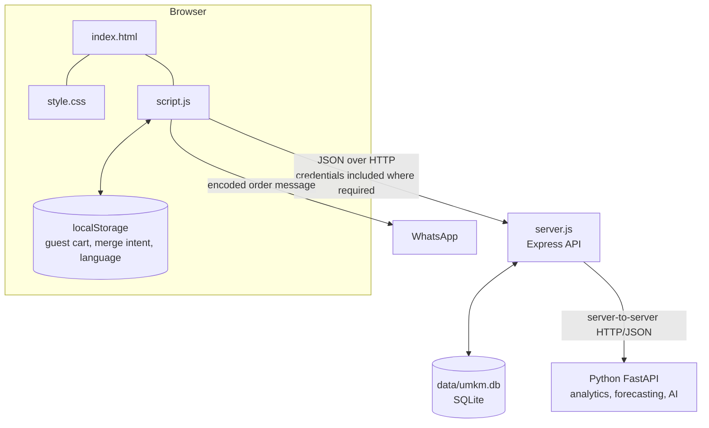
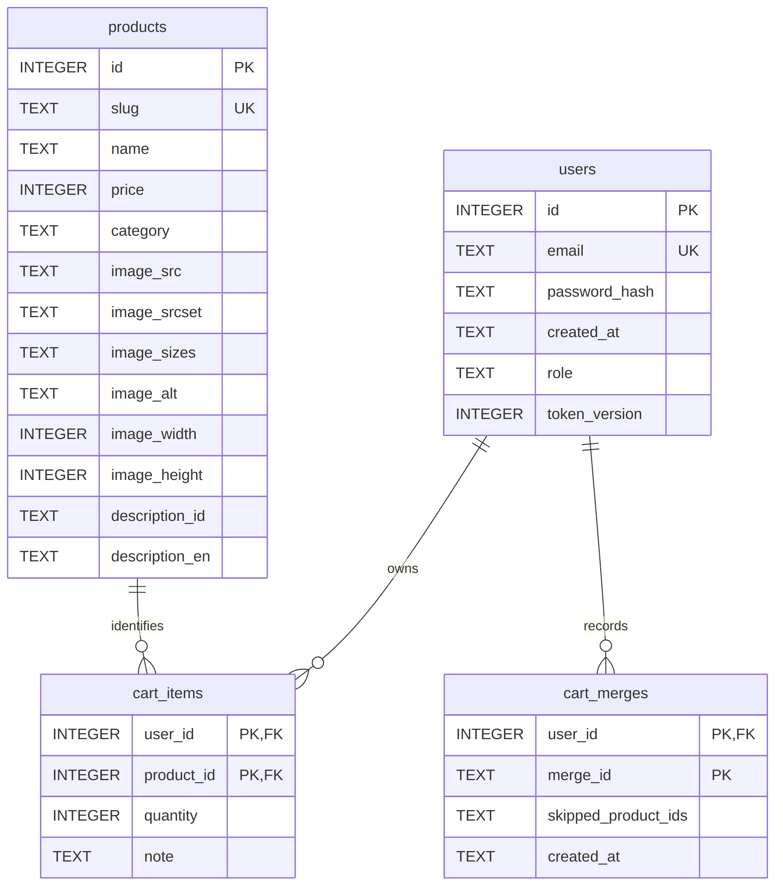
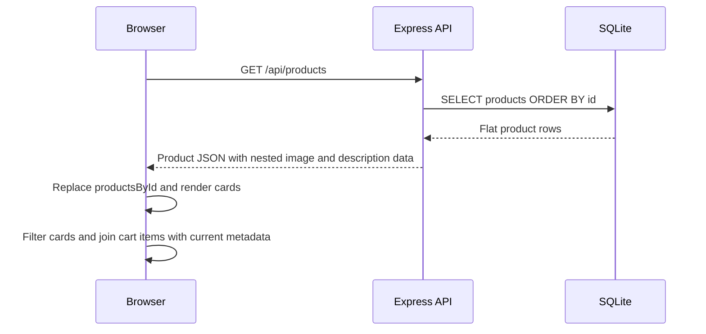
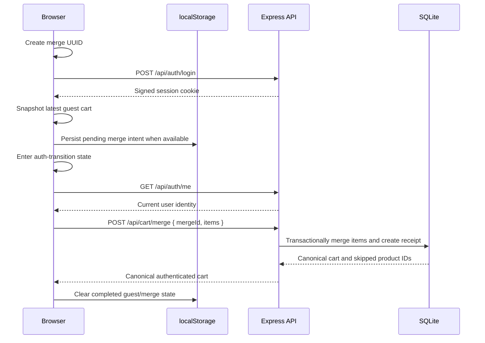

# Architecture

## Scope and system context

Sari Rasa currently consists of a static browser frontend, a Node.js/Express API, and a local SQLite database. It implements a bilingual product menu, cookie-based authentication, database-authoritative roles, product administration, guest and authenticated carts, and WhatsApp checkout handoff.

The implemented system also includes a local Python workspace and FastAPI service for cached V2 analytics, deterministic next-day demand forecasting, and the read-only AI menu assistant (see [Python workspace](#python-workspace-and-independent-data-service-foundation) below). Node/Express calls that service over server-to-server HTTP/JSON and remains the only application-facing backend; the browser does not call FastAPI directly. The project is not presented as a production deployment.

## Component overview



The browser is responsible for presentation, interaction, guest persistence, and temporary transition state. Express is the trust boundary for authentication, authorization, product mutations, and account cart ownership. SQLite is authoritative for products, users, authenticated cart items, and completed merge receipts.

## Frontend architecture

The frontend has no framework, bundler, or build step:

- `index.html` provides semantic page structure, dialogs, forms, navigation, and the static integration points used by JavaScript.
- `style.css` defines the responsive layout, component presentation, interaction states, and accessibility helpers.
- `script.js` contains rendering, translations, API communication, authentication state, cart state, and admin interactions.

### Products and rendering

On startup, `loadMenu()` requests `GET /api/products`. Successful responses replace `productsById`, a `Map` keyed by stable database product ID, and create the visible product cards. Product identity and cart calculations do not depend on card order or DOM position.

Category buttons filter rendered cards by their product category. Indonesian and English dictionaries provide interface text and fallbacks for the seeded product copy. The selected language is stored under `sari-rasa-lang` in `localStorage`.

### Authentication state

The browser does not store authenticated identity in `localStorage` and cannot read the HttpOnly session cookie. `checkAuthState()` calls `GET /api/auth/me` with `credentials: "include"`; the returned current user controls account and admin visibility. The backend remains authoritative for whether that user is authenticated or is an administrator.

### Cart state

One in-memory `Map` holds canonical cart items as `{ productId, quantity, note }`, while `cartAuthority` identifies which persistence model currently owns them:

- Guest items are stored in `localStorage` under `umkm-cart:v1`.
- Authenticated items are loaded from and written to the cart API.
- Transition/loading states temporarily block unsafe mutations and checkout.

Guest storage contains no product name, price, or totals. Rendering and WhatsApp message construction join cart items with current data in `productsById`, preventing stale stored metadata from becoming authoritative.

### Admin UI and API communication

The product dialog supports creation and full update; product cards expose edit/delete controls for a current admin. This visibility is a user-experience decision only. All product mutations still use credentialed API requests and are enforced by backend authorization.

The frontend resolves its API base from the current HTTP(S) origin in production, so the trusted edge routes `/api/*` to Node without exposing the private Python service. The explicit local Live Server development contract remains `localhost:5500` → `localhost:3000`. Browser authentication and cart requests use `credentials: "include"`. The product list itself is public and does not require credentials.

## Backend architecture

`server.js` defines the Express 5 application. It exports:

- `app`, allowing tests to import the configured application without automatically listening;
- `startServer(port)`, which supports an ephemeral port in tests; and
- `parseConfiguredPort(value)`, which validates the runtime port.

Running `node server.js` directly starts the server. The default port is 3000.

### Middleware and request handling

The application configures:

- CORS restricted to `http://localhost:5500`, with credential support;
- `express.json()` request parsing;
- `X-Content-Type-Options: nosniff`, `X-Frame-Options: DENY`, and `Referrer-Policy: no-referrer`;
- `requireAuth` for authenticated routes;
- `requireAdmin` after authentication for product mutations; and
- fixed-window, in-memory rate limiting for registration and login.

Unknown routes receive a JSON 404. The global error handler distinguishes malformed JSON from unexpected failures and returns generic server errors rather than exposing internal details.

### HTTP API

| Area | Routes | Authority |
|---|---|---|
| Health | `GET /api/health` | Public |
| Products | `GET /api/products`, `GET /api/products/:id` | Public |
| Product mutations | `POST /api/products`, `PUT /api/products/:id`, `DELETE /api/products/:id` | Authenticated admin |
| Authentication | `POST /api/auth/register`, `POST /api/auth/login` | Public, rate-limited |
| Authenticated identity | `GET /api/auth/me`, `POST /api/auth/logout` | Authenticated user |
| Admin accounts | `GET /api/admin/users`, `PATCH /api/admin/users/:id/role` | Authenticated admin; mutation also requires trusted origin and rate limit |
| Cart | `GET /api/cart`, `PUT /api/cart/items/:productId`, `DELETE /api/cart/items/:productId`, `DELETE /api/cart` | Authenticated owner |
| Cart merge | `POST /api/cart/merge` | Authenticated owner |
| AI menu assistant | `POST /api/ai/menu-assistant` | Public, rate-limited, read-only Node → FastAPI gateway |

Product handlers validate identifiers and request fields before using parameterized SQL. Cart handlers never accept a user ID as ownership authority; they derive it from `req.user.id`.

## Database architecture

`db/database.js` opens SQLite through `better-sqlite3`. Development defaults to `data/umkm.db`; production requires an explicit absolute `DATABASE_PATH` for the FE-A durable-storage mount. Every connection enables and verifies SQLite foreign-key enforcement.

There is **no server-side session table**. The signed cookie carries the session payload, while protected requests validate it against the current `users` row and its `token_version`.



Important database rules include:

- unique product slugs and user emails;
- roles limited to `user` or `admin` on the supported schema;
- one cart item per `(user_id, product_id)`;
- integer cart quantities from 1 through 99;
- text notes no longer than 200 characters;
- product and user foreign keys with `ON DELETE CASCADE` for cart items;
- user deletion cascading to merge receipts; and
- one immutable merge receipt per `(user_id, merge_id)`.

Startup creates missing tables and performs narrowly supported, idempotent column evolution for role, token revocation, bilingual product descriptions, and skipped-product merge metadata. Eleven products are seeded only when the products table is empty. Description backfill does not overwrite rows whose descriptions have already been edited.

## Product data flow



SQLite stores image and description fields as columns. The API maps each row to the nested JSON shape consumed by `script.js`. The frontend then uses `productsById` for rendering, totals, cart details, edit forms, and WhatsApp checkout content.

## Authentication and session lifecycle

### Registration

The registration endpoint validates the submitted email and password, normalizes the email with trimming and lowercase conversion, hashes the password with bcrypt cost 12, and inserts only the email and password hash. The database default assigns role `user`; a registration request cannot self-assign `admin`.

### Login

Login normalizes the email and verifies the submitted password. A dummy bcrypt comparison also runs for unknown emails so that missing-user responses do not intentionally take a faster path. On success, the server signs a payload containing user ID, current token version, and issue time with HMAC-SHA256.

The cookie is:

- `HttpOnly`, so frontend JavaScript cannot read it;
- `SameSite=Lax`;
- `Secure` unless `NODE_ENV` is exactly `development`; and
- limited to the same 24-hour maximum age enforced inside the signed payload.

`SESSION_SECRET` must exist and contain at least 16 characters. A much longer random value is recommended because possession of this key permits session forgery.

### Session restoration and authorization

For every protected request, `requireAuth` parses and verifies the cookie, loads the current user from SQLite, compares the signed token version with the current database value, and attaches `{ id, email, role }` to `req.user`. `/api/auth/me` returns that current identity to the frontend.

This database lookup means role and token revocation state remain authoritative even when the browser holds an older signed cookie.

### Logout

Logout first increments the user's `token_version`, invalidating previously issued cookies for that account, and then clears the browser cookie with matching security attributes. A copied pre-logout cookie is rejected on subsequent protected requests.

## Account and admin extension (Phase 6-EXT)

Status: Phase 6-EXT-A through 6-EXT-H and Phase 6-EXT overall are **VERIFIED COMPLETE**. Admin management, password recovery, real Resend delivery, controlled provider failure, integrated reset/login/session revocation, and password-visibility accessibility received their required automated and user-performed acceptance. [Account & Admin Extension](ACCOUNT_ADMIN_EXTENSION.md) is the detailed source of truth.

The implemented extension adds admin-only account listing/role management, password-reset lifecycle handling, a vanilla-JavaScript recovery flow, and a Resend delivery adapter to the existing frontend → Node/Express → SQLite account system. The existing auth dialog now owns login, registration, forgot-password, and reset-password states. It retains only `user` and `admin`, signed-cookie sessions, and database-authoritative authorization. Real-provider inbox acceptance passed using runtime-only local configuration. Authentication remains distinct from authorization; Python/AI services are outside this account boundary.

The server authenticates and authorizes every account-management request and enforces **“SariRasa must always retain at least one administrator.”** A SQLite `BEGIN IMMEDIATE` transaction acquires the write lock before rechecking actor authority/session version, the target, and global admin count. Self-demotion is rejected and concurrent demotions cannot both remove the final administrators. The first admin is provisioned with `npm run admin:provision -- --email <email>`, which promotes an existing registered account—never by default credentials, first-user auto-promotion, startup seeding, or a public endpoint. The Phase 6-EXT-C management UI passed automated and user-performed acceptance.

Password recovery uses `POST /api/auth/forgot-password` and `POST /api/auth/reset-password`, a dedicated `password_reset_tokens` table, and an injected server-side delivery adapter. A 32-byte random base64url token expires after 30 minutes; only its SHA-256 digest is stored. Supersession and successful bcrypt password replacement use `BEGIN IMMEDIATE`; conditional one-time consumption, all-token invalidation, and session revocation through `token_version` commit atomically. Valid forgot requests always return the same generic `202`; provider dispatch is detached from HTTP completion and failures are redacted. Layered process-local throttling, JSON-only requests, trusted `APP_PUBLIC_ORIGIN`, and exact `FRONTEND_ORIGIN` checks protect both public mutations. Success clears the calling cookie defensively and returns the user to normal login without automatic authentication.

Phase 6-EXT-F connects that interface to a thin Resend HTTP adapter using Node's built-in `fetch`, so vendor credentials, payload, sender formatting, response mapping, and a ten-second timeout remain outside core reset logic. Development/test defaults to explicit non-network `disabled` mode; production fails startup unless Resend mode, API key, and a valid sender are configured. Provider rejection/authentication, rate limit, unavailability, timeout, and network failures become allowlisted operational categories without provider-body leakage. The committed token stays unconsumed after failure because delivery may have succeeded before a transport error; a later request safely supersedes it.

The frontend reads `reset_token` only from the initial URL query, requires one 43-character base64url value for client-side UX, immediately removes the query from browser history, and retains the credential only in memory until success, invalidation, or leaving the flow. It never stores or renders the token. Forgot-password responses use one generic bilingual success state. Reset submits only `{token,password}`, treats the backend as authoritative, maps every unusable token to one invalid/expired/used state, clears password fields and the in-memory token on success, drops stale local identity, and rechecks `/api/auth/me`; it never creates a session. Generation and pending guards prevent duplicate submissions and stale recovery responses from replacing a newer auth view.

Password visibility controls remain native `type="button"` elements with synchronized `aria-pressed` and bilingual dynamic accessible names. Login, registration, and the two reset fields preserve values and independent state while mode changes reset visibility to hidden. Manual keyboard/mobile/zoom acceptance passed after right-edge alignment and proportional focus-ring revisions. Safari + VoiceOver may occasionally include “Closing” in its announcement when the pressed state changes; inspection and retest found no application menu/dialog/status mutation, the navigation remained closed, the dialog remained open, and focus stayed on the toggle. This is an accepted non-blocking platform announcement, not a reason to replace standards-compliant semantics with an accessibility hack.

## Guest-to-authenticated cart merge



Guest items use only `productId`, `quantity`, and `note`. Explicit login creates the merge UUID before sending credentials, then captures the latest guest-cart snapshot after login succeeds. When storage is available, that snapshot and UUID are retained as a pending intent so safe retry uses the same payload and identity. The cart enters its transition state before the subsequent auth check. Storage failure does not falsely claim durable reload recovery; the current page retains safe in-memory recovery state and keeps the transition locked when it cannot safely complete.

The server owns the target account through `req.user.id` and performs the merge in a SQLite transaction:

- a new product is inserted into the account cart;
- overlapping quantities are added and capped at 99;
- a non-empty guest note replaces the existing note;
- an empty guest note preserves the existing server note;
- products that no longer exist are skipped and reported; and
- the receipt key `(user_id, merge_id)` makes retries return the original result without reapplying changes.

The same merge UUID remains independent across different users because user ID is part of the receipt key. After success, the canonical server response becomes the browser's authenticated cart.

## Authenticated cart writer

Authenticated cart interactions update the in-memory model and UI immediately, then schedule persistence per product. The writer provides bounded coordination rather than a general offline-sync engine:

- one request for a product runs at a time;
- rapid changes coalesce toward the latest desired state;
- note writes use a 450 ms debounce;
- blur or change events flush pending note work;
- zero quantity uses the item DELETE route;
- failed writes trigger a canonical cart reload;
- cart epoch and authenticated-user checks prevent responses from an older context from replacing newer state; and
- logout enters a preparation state, flushes notes, and drains required writes before calling the logout API.

If reconciliation is incomplete or persistence remains unsafe, the frontend marks the cart unsynced and disables WhatsApp checkout. This avoids presenting an order handoff as safe after a failed authenticated write.

## Authorization and trust boundaries

The browser is not a security boundary. It hides admin controls for normal users, but a client can still construct arbitrary HTTP requests.

The backend therefore enforces the actual trust model:

- `requireAuth` derives identity from a valid signed cookie and a current database record;
- `requireAdmin` checks the current `req.user.role` after authentication;
- product creation, update, and deletion require an administrator;
- registration writes no role supplied by the client; and
- cart ownership always uses `req.user.id`, never a client-supplied user identifier.

SQLite constraints and foreign keys provide a second boundary for uniqueness, cart ranges, relationships, and cascade behavior.

## Security controls and limitations

Current controls include:

- bcrypt password hashing with cost 12;
- HMAC-SHA256 signed session cookies with a fail-loud secret requirement;
- HttpOnly, SameSite, Secure, and maximum-age cookie controls;
- current database role and token-version checks on protected requests;
- credentialed CORS and privileged mutation checks restricted to validated `FRONTEND_ORIGIN` (default `http://localhost:5500`);
- backend authentication and admin authorization middleware;
- admin listing with bounded filters/pagination and minimal response fields;
- concurrency-safe role mutation with transaction-time actor/session recheck;
- local, existing-account-only administrator provisioning;
- parameterized SQL and request validation;
- generic unexpected-error responses;
- login, registration, and admin-role-mutation rate limiting;
- security response headers; and
- test-mode guards against direct, canonical, symlinked, or hard-linked access to the development database.

Relevant boundaries remain:

- the system is configured around local development;
- production-like browser authentication requires HTTPS because cookies remain Secure outside explicit development mode;
- rate-limit state is in process memory and resets on restart;
- there is no bundled administrator credential; an operator promotes an existing account locally;
- canonical database backup, verification, and conservative offline restore use the FE-C repository-native operator commands; there remains no destructive reset/reseed command; and
- these controls are not a claim of complete production hardening.

## Testing architecture

### Backend and database suite

The backend suite uses Node's built-in `node:test` runner with test concurrency fixed to one. Each test file creates a temporary directory and SQLite database, sets an isolated environment, starts the imported application on an ephemeral port, and closes the server/database before removing its temporary resources and restoring environment variables.

Coverage includes products, authentication, signed-cookie behavior, session revocation, authorization, CORS, rate limiting, cart ownership, merge semantics and idempotency, schema constraints, cascades, supported schema evolution, startup idempotency, and seed-data preservation.

When `NODE_ENV=test`, startup requires `DATABASE_PATH`. Before opening SQLite, the database module rejects the normal development path, its canonical/symlink aliases, and existing files with the same device/inode identity, which also covers hard links.

### Frontend VM suite

The frontend suite reads the actual `script.js` source and executes it in `node:vm`. The harness supplies only the browser boundaries required by the tested behavior:

- a minimal fake DOM;
- localStorage-compatible storage with controllable failures;
- controlled fetch routing and manually ordered promises;
- a deterministic timeout scheduler; and
- fresh state for each scenario.

A small probe is appended to the loaded source **in memory** to observe selected lexical state and invoke production functions. The probe is never written into `script.js`, and production code exposes no test-only global.

### Integration contracts and verification baseline

Contract tests read the real files to verify that:

- every literal `getElementById` dependency in `script.js` exists exactly once in `index.html`;
- required class-based controls and the production script reference exist; and
- frontend API paths and methods correspond to Express routes.

The Phase 6-EXT-H automated baseline is 72 backend tests plus 95 frontend tests, for 167 combined Node tests, alongside the previously verified 341 Python tests. Automated VM coverage is distinct from user-performed browser acceptance. Phase 6-EXT-C adds focused navigation, listing, search/filter/pagination, mutation/protection, authorization-loss, stale-response, and i18n coverage. Phase 6-EXT-G adds fail-closed privileged UI removal on an authoritative admin-operation `403`, one authoritative auth recheck after returning from a hidden page, and focused stale-role tests. Required C/E browser, F real-provider, and G integration acceptance all passed.

## Key engineering decisions

### Vanilla frontend

HTML, CSS, and browser JavaScript keep DOM behavior, accessibility state, asynchronous control, and client-side data ownership explicit. This supports the project's frontend-learning goals without introducing framework abstractions.

### SQLite persistence

SQLite provides relational constraints, transactions, and durable local state with minimal operational overhead appropriate to the current local project scope.

### Signed-cookie authentication

The custom minimal session format demonstrates server-verifiable identity without exposing the cookie to frontend JavaScript. Database role and token-version lookups keep mutable authorization and revocation state authoritative.

### Separate guest and account carts

Browser storage allows useful anonymous shopping, while server-backed account carts provide authenticated persistence and ownership. The explicit transition prevents one authority from silently overwriting the other.

### Idempotent merge and coordinated writers

Merge receipts make guest-cart transfer retry-safe. Per-product serialization, coalescing, debounce, reconciliation, and epoch checks address the stale/out-of-order writes that arise once a cart persists asynchronously.

### Built-in testing tools

`node:test` and `node:vm` provide permanent behavioral coverage without adding a test framework or a second implementation of the frontend logic.

### Development-database protection

Tests fail before opening the real development database, including when a filesystem alias points to the same file. This turns preservation of developer-owned local state into an enforced invariant rather than a convention.

## Python workspace and independent data-service foundation

Phase 4A introduced a repository-local Python workspace at `python/`, containing the `sari_rasa_data` package and pytest suite (`python/tests/`). It now includes the Phase 4 foundations, the shared cached V2 analytics pipeline, Phase 5 production forecasting, Phase 6 experimental deep learning, and the `service.py` FastAPI boundary. The service exposes health, four historical analytics endpoints, the production next-day forecast, and an experimental model-comparison endpoint. Importing the application performs no analysis or training. Historical analytics use a stat-invalidated compact snapshot of the trusted configured CSV, while forecast requests validate the active CSV against trusted artifact provenance before inference. The workspace runs inside its own repository-local `.venv`, which is not committed.

The FastAPI process is a separately started specialized service. Node.js/Express remains the only application-facing backend and delegates six `/api/analytics/*` routes through `lib/pythonAnalyticsClient.js` to matching FastAPI routes. Four historical routes accept the same optional, inclusive `start_date` and `end_date` parameters; the production forecast and experimental comparison reject client overrides and always use trusted operator resources. Sales Trend returns dataset-derived bounds for the frontend calendar. `PYTHON_SERVICE_URL` is trusted server-operator configuration, never request/frontend input; callers cannot choose arbitrary upstream paths. The client uses built-in Node `fetch`, exact contracts, and a three-second timeout. Errors remain controlled and redacted. There are no retries, background polling, or direct browser-to-Python requests. Historical dashboard sections share one applied period, while forecast and comparison state/cache are independent and scoped to the effective-admin lifecycle.

```text
Admin Analytics browser UI
    ↓
Node / Express
    ├── GET /api/analytics/summary?start_date=&end_date=
    ├── GET /api/analytics/products?start_date=&end_date=
    ├── GET /api/analytics/categories?start_date=&end_date=
    ├── GET /api/analytics/sales-trend?start_date=&end_date=
    ├── GET /api/analytics/forecast/next-day
    └── GET /api/analytics/forecast/model-comparison
            ↓ built-in fetch, HTTP/JSON, 3-second timeout
        Python FastAPI service
```

Expected dataset, validation, and analytics failures are translated at the route boundary into stable endpoint-specific HTTP 500 details. Internal exception text, filesystem paths, Pandas diagnostics, and implementation details are not returned to clients. The health route remains independent of analytics and data access.

```text
Python service process
    ├── GET /health → {"status":"ok"} (no data access)
    ├── GET /analytics/summary?start_date=&end_date=
    ├── GET /analytics/products?start_date=&end_date=
    ├── GET /analytics/categories?start_date=&end_date=
    ├── GET /analytics/sales-trend?start_date=&end_date=
    └── GET /analytics/forecast/next-day
            ↓
        trusted transactions_ml_v2.csv + next_day_quantity_v2.joblib
            ↓
        cached aggregate analytics + shared ML feature/inference functions
            ↓
        compact JSON analytics and forecast results

No SQLite, browser-to-FastAPI, or transactions_large.csv dependency
```

Phase 4B-1 adds `python/data/transactions.csv` as the canonical synthetic learning dataset and `sari_rasa_data.transactions` as its schema boundary. Each CSV row contains an order ID, ISO date, product ID and name, category, quantity, unit price, and payment method. The schema helper converts CSV-style date and integer strings into typed Python values and rejects missing or invalid required values. It does not load whole datasets, clean data, calculate analytics, access SQLite, or expose a service; those capabilities remain later roadmap work.

Phase 4B-2 adds `sari_rasa_data.data_loader` with separate CSV and JSON file entry points. Both loaders send each record through `parse_transaction_row`, producing the same JSON-compatible dictionary shape with an ISO date string and integer quantity/unit price:

```text
CSV / JSON
    ↓
standard-library loader
    ↓
shared transaction normalization and validation
    ↓
validated JSON-compatible dictionaries
```

The loaders fail on malformed input rather than silently skipping records.

Phase 4B-3 adds `sari_rasa_data.data_transform` for transaction-level cleaning and transformation:

```text
CSV / JSON
    ↓
standard-library loader
    ↓
shared transaction normalization and validation
    ↓
known category/payment normalization
    ↓
line_total transformation
    ↓
validated JSON-compatible dictionaries
```

Cleaning trims text through the shared parser and normalizes only known category and payment-method case variants. Unknown values and invalid dates, quantities, or prices still fail rather than being repaired silently. Transformation adds only `line_total = quantity * unit_price`, returns new dictionaries, and preserves batch order.

Phase 4B-4 completes the plain-Python baseline with dataset-level aggregation over transformed transaction lines:

```text
Synthetic CSV
    ↓
CSV / JSON loader
    ↓
shared validation
    ↓
cleaning
    ↓
transaction transformation
    ↓
pure-Python aggregation
    ↓
JSON-compatible results
```

The Phase 4B aggregation boundary sums line revenue and quantity and groups them by category, product, or ISO date. It does not count transaction rows as unique customer orders. At that checkpoint there was no average-order calculation, ranking, statistics, visualization, database access, network communication, or service; later Phase 4C work builds on this pure-Python baseline.

Phase 4C-1 reuses the Phase 4B pipeline rather than bypassing its rules:

```text
Synthetic CSV
    ↓
Phase 4B load / validate / clean / transform
    ↓
validated transaction records
    ↓
Pandas DataFrame
```

The DataFrame bridge preserves the nine transaction columns, numeric values, input order, and JSON-compatible record conversion. Phase 4C-2 extends that boundary with Pandas filtering, `groupby` sums, and deterministic product-quantity sorting:

```text
Synthetic CSV
    ↓
Phase 4B pipeline
    ↓
Pandas DataFrame
    ↓
filter / groupby / sum / sort
    ↓
JSON-compatible analysis results
```

These operations reproduce the equivalent Phase 4B totals without replacing its validation path. Phase 4C-3 adds explicit NumPy analysis over the same Pandas columns:

```text
Synthetic CSV
    ↓
Phase 4B pipeline
    ↓
Pandas DataFrame
    ↓
selected numeric columns (quantity, unit_price, line_total)
    ↓
NumPy arrays
    ↓
basic statistics (mean, median, min, max, population std, percentiles)
```

`numpy_analysis.column_to_numpy` copies one approved numeric column into a new `numpy.ndarray` without mutating the source DataFrame. `mean_value`, `median_value`, `min_value`, `max_value`, `standard_deviation`, and `percentile_value` return plain Python floats (never NumPy scalar types), and each raises `ValueError` on an empty array instead of silently returning NumPy's NaN. `standard_deviation` uses population semantics (`numpy.std` default, ddof=0), and `percentile_value` validates its percentile argument is between 0 and 100 inclusive. `summarize_numeric_column` composes these into one JSON-compatible dictionary. Pandas remains responsible for tabular representation, filtering, and grouping; NumPy is used only for numeric arrays and statistics over columns Pandas already produced.

### Phase 4C-4 — large synthetic dataset and integrated analysis

Two transaction datasets now exist with clearly separated responsibilities:

| Dataset | Path | Rows | Purpose |
|---|---|---|---|
| Canonical regression fixture | `python/data/transactions.csv` | 30 | small, human-inspectable, used by the Phase 4B/4C-1/4C-2/4C-3 regression tests; never modified by Phase 4C-4 |
| Large synthetic analysis dataset | `python/data/transactions_large.csv` | 10,000 | generated on demand for meaningful Pandas + NumPy analysis; not committed to Git in this phase |

`sari_rasa_data.synthetic_data` generates the large dataset from a single `random.Random(seed)` instance (`DEFAULT_SEED = 20260901`, `DEFAULT_ROW_COUNT = 10_000`), so the same seed and row count always reproduce byte-identical output. It reuses the exact Phase 4B schema fields and deliberately omits `line_total`, which stays a value derived by the Phase 4B transform step rather than raw input. Multiple transaction lines can share one `order_id`, modeling a single order containing several products. The generator encodes moderate, explainable patterns — higher weekend demand, per-month seasonal multipliers (a December peak), per-product popularity weights, a QRIS-leaning payment-method mix, and a small share of bulk-quantity lines — without hard-coding the resulting analysis numbers.

```text
Synthetic CSV (transactions_large.csv)
    ↓
Phase 4B pipeline (load / validate / clean / transform)
    ↓
Pandas DataFrame
    ↓
Pandas analysis (filter / groupby / rank)
    ↓
NumPy statistics
    ↓
JSON-compatible integrated summary
```

`sari_rasa_data.analysis_pipeline` composes the existing Phase 4B/4C-1/4C-2/4C-3 functions — it does not reimplement loading, filtering, grouping, or statistics. It adds only the metrics those modules did not already provide: unique-order counting, order-level average order value (`total_revenue / unique_order_count`, not divided by transaction-line count), an ISO date range, monthly revenue, a weekday/weekend comparison, and payment-method transaction-line counts (documented as line counts, not order counts, since `payment_method` is recorded per transaction line). `analyze_transactions(path)` returns one dictionary of only plain `dict`/`list`/`str`/`int`/`float` values suitable for `json.dumps`.

### Phase 5B — forecasting dataset and feature boundary

Phase 5B adds a third, generated-only dataset with a distinct responsibility:

| Dataset | Path | Default horizon | Purpose |
|---|---|---|---|
| ML development dataset | `python/data/transactions_ml.csv` | 2024-01-01 through 2025-12-31 | deterministic next-day quantity feature development; ignored by Git and regenerated from source |

`sari_rasa_data.ml_synthetic_data` generates transactions chronologically from moderate product/category popularity, day-of-week and month effects, gradual growth, autoregressive continuity, deterministic promotion windows, modest product-mix evolution, and seeded noise. It uses the shared transaction schema but never replaces the canonical analytics fixture or the Phase 4 large integration dataset. The CSV contains no future target or engineered feature columns.

`sari_rasa_data.forecasting` provides the preparation boundary:

```text
Generated transaction rows
    ↓ shared Phase 4 validation/transformation
Continuous daily quantity series (missing dates = 0)
    ↓ next-day alignment
Calendar + lag + shifted rolling features
    ↓ deterministic chronological slicing
Train / validation / untouched test DataFrames
```

Each supervised row uses `date` as its information cutoff and `forecast_date` as the next-day target date. `lag_1_quantity` is the known cutoff-day quantity; lag 7 and lag 14 are aligned relative to the target day. Rolling 7/28-day statistics apply an explicit one-day shift before rolling, so they exclude both the next-day target and the cutoff-day value. The cutoff value is available only through lag 1. Initial rows without 28 prior days and the final row without a next-day target are dropped rather than imputed. Splitting preserves chronological order and creates no overlapping forecast dates. Phase 5B performs no model fitting, scoring, persistence, serving, Node integration, or UI work.

### Phase 5C — validation baseline boundary

`sari_rasa_data.baseline_forecasting` establishes model-independent benchmarks without adding scikit-learn. Previous-day and previous-week predictions map directly to `lag_1_quantity` and `lag_7_quantity`. The approved trailing-seven-day baseline is calculated against the continuous daily series from forecast date minus seven through forecast date minus one, so it includes the known origin-day quantity and never includes the forecast-date actual. It intentionally does not reuse the Phase 5B `rolling_mean_7` model feature, whose shifted window ends one day earlier.

```text
Continuous daily series + supervised frame
    ↓ chronological split
Validation frame only (105 rows)
    ├── previous-day prediction
    ├── previous-week prediction
    └── trailing-seven-day mean prediction
            ↓
       MAE / RMSE ranking
            ↓
Previous-week baseline selected for Phase 5D comparison

Final test frame (106 rows) ── untouched in Phase 5C
```

The evaluation function accepts an explicitly supplied validation frame and has no test-frame parameter or test-evaluation path. MAE is the primary selection metric and RMSE is secondary. Metric helpers reject invalid shapes, empty input, length mismatch, non-finite values, and arithmetic overflow. This phase selects no trained model and creates no artifact, service endpoint, Node route, or browser feature.

### Phase 5D — classical model selection and final evaluation boundary

`sari_rasa_data.model_training` consumes the existing supervised frame through a strict feature allowlist. `date`, `forecast_date`, and `target_next_day_quantity` never enter `X`; the target is separated as `y`. Ridge candidates wrap `StandardScaler` and `Ridge` in one scikit-learn `Pipeline`, so scaling is fitted on the same permitted partition as the estimator. HistGradientBoosting candidates use fixed configurations, disabled early stopping, and a fixed random state.

```text
TRAIN (491)
    ↓ fit 5 Ridge + 3 HistGradientBoosting candidates
VALIDATION (105)
    ↓ MAE-primary selection + descriptive permutation importance
Frozen winning specification
    ↓ refit preprocessing/model on TRAIN + VALIDATION only
TEST (106)
    ↓ one issued-selection evaluation
Final model and previous-week baseline metrics + diagnostics
```

Selection accepts no TEST argument. Shared partition validation rejects missing, duplicate, unsorted, reversed, or overlapping forecast dates. The previous-week validation benchmark is recomputed from the supplied validation target and lag-7 values rather than trusted as a stale constant. A selected configuration carries an opaque process-local token; final evaluation validates its provenance, ranked winner, and estimator family, then consumes the token immediately before its first TEST feature/target access. The same issued selection cannot evaluate TEST twice in that process. This technical gate complements the procedural rule that TEST results are not used for retuning across process restarts.

The final policy is **refit after selection**: rebuild the frozen winning specification, fit all preprocessing and the estimator on combined TRAIN+VALIDATION, then predict TEST once. The returned prediction frame supports one diagnostic pass without another model call. No result is fed back into candidate choice. Validation permutation importance is a lightweight description of predictive associations on the same validation data used for selection; it is not a causal claim or independent generalization estimate.

Phase 5D's evaluation record remains unchanged and unbiased. Phase 5E subsequently refits the exact frozen specification on all available supervised history for deployment usefulness.

### Phase 5E — trusted artifact and prediction service boundary

```text
Generated ML transactions (2024-01-01…2025-12-31)
    ↓ shared daily aggregation and Phase 5B feature engineering
All available supervised rows (forecast dates 2024-01-30…2025-12-31)
    ↓ frozen Phase 5D HistGradientBoosting specification; no retuning
python/models/next_day_quantity_v1.joblib (generated, Git-ignored)
    ↓ fixed operator-controlled path + strict metadata/type validation
GET /analytics/forecast/next-day
```

The schema `1.0` artifact is a joblib dictionary containing `metadata` and the fitted `model`. Metadata records the exact ordered features, target, one-day horizon, model family and hyperparameters, training dates/policy, generator identity and seed, model random state, and Python/scikit-learn versions. Loading fails closed on missing, corrupt, structurally invalid, wrong-version, wrong-family, wrong-feature, wrong-target/horizon/policy, or wrong-estimator artifacts.

Joblib uses executable pickle deserialization. The model path is therefore trusted operator configuration only (`SARI_RASA_MODEL_ARTIFACT_PATH`, with a repository-local default), never an API parameter or upload. The ML source is likewise operator configuration (`SARI_RASA_ML_DATASET_PATH`). The active defaults are the ignored V2 dataset and V2 artifact; historical analytics share that V2 transaction history through `SARI_RASA_ANALYTICS_DATASET_PATH`. Tests explicitly inject the small canonical CSV where a deterministic fixture is required. The V1 flow above remains historical implementation evidence.

Inference takes transaction history, creates a continuous daily series (missing calendar days become zero), and calls the shared Phase 5B feature builder. It requires at least 29 continuous days and rejects invalid, duplicate, unsorted, non-finite, negative, or fractional daily quantities. The response preserves the finite floating-point regression output without rounding or clamping. Missing/incompatible artifacts and invalid internal source data produce a redacted HTTP 503. The service never trains during import, startup, or a request.

### Phase 5F — Node forecast gateway boundary

```text
Browser / API consumer
    ↓ GET /api/analytics/forecast/next-day
Node/Express gateway
    ↓ trusted PYTHON_SERVICE_URL; GET; 3000 ms; no retries
FastAPI GET /analytics/forecast/next-day
    ↓
Trusted local joblib artifact + ML history
```

`lib/pythonAnalyticsClient.js` owns the shared Node-to-Python URL validation, built-in `fetch`, `AbortController`, timeout cleanup, and failure classification. Its forecast client accepts only the exact schema: a real ISO calendar date, finite numeric prediction, model family `hist_gradient_boosting`, artifact schema `1.0`, and integer one-day horizon. Extra fields, coercible strings, malformed JSON, non-2xx responses, and unsupported model metadata are rejected rather than proxied.

### Phase 5G — forecast presentation and historical context

`GET /analytics/forecast/next-day` now derives forecast and business comparison context from one trusted continuous daily quantity series. `data_through` is the last trusted historical date. The trailing 7- and 28-day averages include that cutoff day and every calendar day before it in the window; a date with no transaction rows is reindexed to quantity zero. These are comparison metrics, not a claim that the model uses only those windows. The model retains its existing calendar, lag, and shifted rolling features. Fewer than 28 complete historical calendar days fails closed, and a zero average produces a JSON `null` comparison rather than NaN or Infinity.

```text
Trusted ML CSV + versioned artifact
  ↓ one continuous daily series
Python forecast + 7D/28D business context
  ↓ exact extended JSON contract
Node strict schema/date/model validation (3 s, no retry)
  ↓ GET /api/analytics/forecast/next-day
Admin Analytics forecast panel
```

Node validates non-negative finite quantities/averages, finite-or-null comparisons, exact model metadata, and `forecast_date = data_through + 1 calendar day`. It does not recalculate forecast values. The browser calls only Node, formats values for ID/EN, and keeps forecast state separate from range-filtered analytics. A successful response is cached for the current effective-admin lifecycle; range Apply does not reload it. Logout or effective admin changes reset the cache/generation, so an older in-flight response cannot render into a newer identity. Retry targets only forecast. Native disclosure, semantic live/alert states, neutral comparison wording, focus treatment, responsive order, and reduced-motion behavior provide the accessibility boundary.

The Express route accepts no query parameters and cannot receive an upstream URL, artifact path, dataset path, model family, or version override. It matches the existing read-only analytics API authorization behavior; those Node analytics routes are not guarded by admin middleware, while the current dashboard remains admin-only in the browser. Timeouts map to a redacted 504; network, upstream non-2xx, JSON, and contract failures map to a redacted 502. Python bodies, exception messages, filesystem paths, and service topology are never returned. The browser still never calls FastAPI directly, and Phase 5F adds no frontend rendering.

### Phase 5F-R — V2 experiment and serving refinement

V1 remains historical verified evidence with its original two-year dataset, selected parameters, metrics, and `next_day_quantity_v1.joblib`. V2 is separate:

```text
11-product application/database seed catalog
    ↓ deterministic V2 generation (seed 20260902)
transactions_ml_v2.csv: 750,000 transaction rows / 693 days / 11 products
    ↓ chunked validation + daily quantity aggregation
664 next-day supervised observations; unchanged ten features
    ↓ TRAIN 479 → VALIDATION 92; TEST 93 isolated
8 predefined classical candidates → frozen V2 winner
    ↓ one TEST evaluation, then serving refit on all 664 rows
next_day_quantity_v2.joblib
    ↓ FastAPI /analytics/forecast/next-day
Node /api/analytics/forecast/next-day
```

The V2 generator streams rows rather than building a 750K-dictionary collection. It includes synthetic weekday/month/growth/event/spike, correlated-noise, order-size, quantity, payment, and evolving product-popularity assumptions; these are simulation choices, not claims about measured Indonesian consumer behavior. No event flag enters the model. Artifact schema remains `1.0`, while metadata identifies experiment `2.0`, dataset SHA-256, 750K transaction rows, 664 daily supervised rows, dates, seed, and frozen parameters. The trusted joblib boundary and external response remain unchanged.

### Phase 4G-R2 — shared V2 analytics snapshot

```text
trusted SARI_RASA_ANALYTICS_DATASET_PATH
    ↓ default: transactions_ml_v2.csv; exact identity verification
vectorized validation + one transient 750K DataFrame
    ↓ compact and release raw frame
daily (693) + daily-product (7,623) + daily-category (2,079)
    ↓ arbitrary inclusive date masks and compact aggregates
FastAPI → Node/Express → existing Phase 4 dashboard
```

The in-process cache key combines resolved trusted path with device, inode, size, and nanosecond mtime. Unchanged requests reuse one immutable aggregate snapshot. File replacement, regeneration, modification, or operator path change triggers a locked reload; a failed reload never installs an invalid snapshot. The configured V2 default additionally verifies 750,000 rows, exact date boundaries, and SHA-256. Dataset paths never come from HTTP input.

Only aggregate JSON leaves FastAPI. Full Sales Trend is 693 daily points (~62 KB), not 750K rows. The transient raw frame is released after producing 693 daily, 7,623 daily-product, and 2,079 daily-category rows. Current 11-product measurements remain about 2.3 seconds cold, milliseconds warm, and 2.305 seconds through Node for a cold trend, so Node retains its three-second timeout. Existing frontend SVG/calendar/race-handling code is unchanged; 5F-R2 manual browser acceptance passed with exactly the 11 application products visible in Product Performance and stable repeated navigation.

The pre-4G-R2 analytics pipeline fully reloaded and validated the CSV for each calculation, taking about seven seconds per V2 request. Phase 4G-R2 replaces that repeated-load path with the shared compact snapshot above. Runtime dashboard analytics now default to V2; the canonical small fixture remains available explicitly for deterministic tests. Raw V2 rows are never returned to Node or the browser.

## Current boundaries and future scope

Current verified work includes the frontend foundation, Express API, SQLite-backed full-stack application, authentication, authorization, product administration, persistent carts, the automated regression foundation, the project documentation/runbook, the Phase 4A Python foundation workspace, the complete Phase 4B pure-Python pipeline, and the complete Phase 4C Pandas/NumPy analysis (4C-1 through 4C-4). Phase 4D-1 through 4D-4 and Phase 4D as a whole are verified complete after hardening, automated verification, documentation, independent review, and final user manual acceptance. The Python service remains a separately started process and is now integrated behind Node's Phase 4E analytics routes.

### Phase 6 experimental deep-learning boundary

Phase 6 reuses the frozen V2 ten-feature next-day total-demand problem with one CPU `Linear(10, 16) → ReLU → Linear(16, 1)` MLP. TRAIN-only feature scaling and raw-output MSE optimization use Adam at learning rate `0.01`, batch size `32`, seed `20260903`, at most 200 epochs, and patience 20. VALIDATION MAE alone selects the restored checkpoint; evaluation/inference predictions are clamped to zero minimum. TEST was evaluated once only after this policy was frozen.

```text
Trusted V2 CSV
    ├── TRAIN → fit scaler + MLP optimization
    ├── VALIDATION → MAE checkpoint/early stopping only
    └── frozen TEST → one final comparison only

Generated ignored MLP artifact (.pt)
    ├── exact allowlisted architecture and CPU state_dict
    ├── TRAIN scaler + ordered features
    ├── frozen training/prediction policy
    └── framework, dataset SHA, and catalog provenance
```

The DL loader uses PyTorch restricted weights-only deserialization and fails closed on unexpected structure, incompatible policy/version/provenance, wrong tensor keys/shapes/dtypes/devices, or non-finite values. `dl_prediction.py` reuses the established feature builder, verifies the dataset SHA, applies the stored scaler, and clamps the experimental result. It never replaces `prediction.py` or the production HGB artifact. Missing or invalid DL resources yield a redacted FastAPI 503 and generic Node 502; Node never falls back to HGB because that would misrepresent the comparison.

The frozen TEST record is HGB `135.5097`/`177.6172`, MLP `147.2643`/`193.5776`, and previous week `178.3333`/`228.5035` (MAE/RMSE). MLP MAE is 8.67% higher than HGB, so HGB remains production and MLP remains experimental. Phase 5 TEST outcomes were known before Phase 6, making the exercise methodologically frozen but not psychologically blind.

The Admin Analytics model-comparison panel sits below the unchanged production forecast and labels HGB/MLP/previous week as Production/Experimental/Benchmark. It fetches independently from the historical date filter, uses isolated loading/error/retry and stale-response protection, and places current MLP inference only in secondary disclosure content. Desktop uses three cards, tablet may wrap, and mobile stacks them without a narrow table.

Phase 4E Node-to-Python integration, Phase 4F, Phase 4, and the approved post-quality-gate Phase 4G extension including 4G-R2 are verified complete. Phase 5A through Phase 5H, 5F-R, and 5F-R2 are verified complete. Phase 6A through Phase 6I and Phase 6 overall are verified complete after frozen evaluation, fail-closed artifact/inference and service integration, responsive/manual dashboard acceptance, full regression, provenance/security review, and documentation consistency. Phase 6-EXT-A through 6-EXT-H and Phase 6-EXT overall are verified complete. Phase 7A–7H and aggregate Phase 7 are verified complete after offline and controlled live verification, fixed retrieval evaluation, three retrieval experiments, safety gates, human review, and final reconciliation. Phase 8A–8J and aggregate Phase 8 are verified complete after final automated regression and user-performed browser language acceptance.

### Phase 7A provider-neutral LLM boundary

Phase 7A is a Python-only learning foundation and is not connected to FastAPI, Node, the browser, authentication, accounts, or persisted conversations:

```text
Python caller
    ↓ LLMRequest / LLMResponse
LLMClient protocol
    ↓
GeminiLLMClient adapter
    ↓ HTTPS, bounded timeout, no retries
Gemini Developer API
```

Callers see only validated request fields (`system_instruction`, `user_input`, `language`, `max_output_tokens`, optional `correlation_id`) and a normalized response (text, provider/model identity, finish reason, optional token usage, latency, correlation ID). Raw Gemini payloads and provider-specific response structures never leave the adapter. Configuration is loaded lazily from `SARI_RASA_LLM_*` environment variables, including the model through `SARI_RASA_LLM_MODEL`, so imports perform no configuration read that can fail and no network request. The model has no source-code default because availability and Free Tier eligibility are account- and time-dependent. Phase 7A live acceptance verified `gemini-3.1-flash-lite` on the Gemini Developer API and successfully normalized the real response through this provider-neutral contract.

The deterministic fake supplies Indonesian/English responses and controlled failure behavior for offline tests. Gemini HTTP is mocked for adapter tests. The completed one-shot live acceptance used only fictional/public-safe menu content. The Free-Tier, zero-cost-first policy remains in effect and required no billing setup for Phase 7A. Free Tier content may be used by Google to improve its products, so credentials, authentication/session data, personal email, private account/admin rows, and confidential business data must never be sent across this boundary.

### Phase 7B public-menu prompt boundary

Phase 7B remains Python-only and provider-neutral:

```text
caller-supplied public catalog
    ↓ PublicMenuItem allowlist projection
deterministic language-specific trusted catalog JSON
    ↓ versioned ID/EN prompt policy + separate untrusted input
Phase 7A LLMRequest
```

`PublicMenuItem` is an immutable strict allowlist: `product_id`, `slug`, `name`, `category`, `price_rupiah`, `description_id`, and `description_en`. Phase 7B does not read SQLite, call Node, or use `application_catalog`; the future Node/SQLite adapter remains Phase 8 work. Serialization sorts by product ID and slug, rejects duplicate identities, uses only the selected language description, and emits no private, transactional, authentication, admin, operational, or secret fields.

The customer/menu prompt (`phase-7b.customer-menu.v1`) and bounded recommendation prompt (`phase-7b.menu-recommendation.v1`) share explicit grounding, insufficiency, authority, privacy, injection-resistance, and concise-response rules. Indonesian is the default and uses `description_id`; English is explicit and uses `description_en`. Recommendations are limited to supplied products and evidenced catalog attributes plus explicit user preferences. Catalog JSON is delimited as trusted reference data that cannot act as instructions, while raw user text exists only in separately delimited `LLMRequest.user_input`. Phase 7B adds no schemas, tool calling, retrieval, persistence, runtime integration, or provider feature dependency. Deterministic offline tests use synthetic public fixtures and require no network or API key.

### Phase 7C structured output and bounded tool boundary

Phase 7C adds `StructuredLLMClient.generate_structured()` separately; the Phase 7A `LLMClient.generate(LLMRequest) -> LLMResponse` contract remains intact. `StructuredLLMRequest` wraps the Phase 7B-built prompt with immutable caller-supplied allowed source IDs, public catalog values, zero tools or exactly one registered `search_menu` tool, and a schema version. The immutable provider-neutral `phase-7c.public-menu-response.v1` response contains only `answer`, `sources`, `insufficient_information`, `limitations`, and `language`. Strict application-owned JSON parsing rejects malformed provider output, missing/extra fields, incorrect types, unsupported or mismatched language, duplicate sources, and unknown source IDs; invalid sources are never removed or presented as grounded.

Allowed source IDs remain caller-owned and application validation remains authoritative. The normalized IDs are also sorted into a deterministic trusted `ALLOWED_SOURCE_IDS_JSON` prompt block. The model is instructed to use only exact IDs from that block, never derive IDs from `product_id`, slug, name, or other catalog fields, and return an empty source list when no source is supportable.

`search_menu` is the only executable tool. It performs normalized case-insensitive substring matching against name, slug, category, and the selected language description, sorts results deterministically by product ID/slug, and limits results to 1–5. Its strict arguments are `query`, optional `language`, and optional `limit`; results contain only the `PublicMenuItem` allowlist. It cannot execute SQL, shell, filesystem, browser, arbitrary network, mutation, account, authentication, admin, cart, order, or payment behavior. There is no recursive or generic executor and parallel tool calls are rejected. The adapter permits at most two sequential calls, rejects identical-call loops, unknown tools, malformed arguments, and simultaneous calls, and disables further function calling for the final provider turn after the second valid execution.

Gemini-specific `responseMimeType`, response schemas, function declarations/calls/responses, HTTP failures, and safety/refusal shapes stay inside `GeminiLLMClient`. Provider schemas use the subset supported by the Gemini REST Schema contract and do not send unsupported `additionalProperties` hints; application validation enforces strictness that the provider schema cannot express. Zero-tool requests omit tool declarations. Gemini 3 function-call IDs are returned in matching `functionResponse` values, while original candidate content is retained across tool turns so required `thoughtSignature` context survives. Call IDs and thought signatures remain adapter-internal and never enter the provider-neutral contract. After the two-call maximum, application orchestration requests a tool-disabled final turn and rejects any unexpected further tool call before execution.

Tests use `httpx.MockTransport` and deterministic catalogs; normal imports and offline regression need no API key or network. Real Gemini acceptance with `gemini-3.1-flash-lite` passed structured-only and real `search_menu` scenarios using fictional public-safe data. Phase 7C is verified complete. Vector search, RAG, agents, Node/browser integration, and deployment remain deferred.

### Phase 7D local-first embedding boundary

Phase 7D projects each caller-supplied `PublicMenuItem` and requested language into one immutable input. Canonical text version `7d-catalog-text-v1` uses fixed canonical product-name, category, and selected-description lines; it applies deterministic Unicode NFKC and whitespace normalization, selecting `description_id` for `id` or `description_en` for `en` without silent translation. Product ID, slug, price, image, weight, availability, credentials, and private user/account data never enter semantic text. SHA-256 content identity covers only the text version, language, and normalized semantic text with fixed separators, so product identity/storage metadata such as product ID and slug, and mutable price, do not change the semantic content hash. This identity supports later reuse and staleness detection without making Phase 7D responsible for persistence.

`EmbeddingClient.embed(EmbeddingRequest) -> EmbeddingVector` is provider-neutral; the request, vector, and `ProductEmbeddingRecord` contracts are immutable. The product record carries product ID and slug only as non-semantic metadata alongside language, text version, semantic text/hash, provider/model, dimensions, and a plain tuple vector. Application-owned validation requires positive dimensions, a non-empty vector whose length equals those dimensions, numeric finite components, and explicit provider/model metadata. Provider-library objects never become application contracts: adapters convert them into these provider-neutral values. Batching sorts by product ID then slug and emits canonical language order (`id`, then `en`).

`FakeEmbeddingClient` derives stable test-only numbers from SHA-256 and makes no semantic-quality claim. The sole real adapter, `SentenceTransformerEmbeddingClient`, accepts a configurable model name, defaults to CPU and local-only loading, imports and loads its library/model only on first use, converts output to provider-neutral values, and maps load/inference failures to sanitized typed errors. There is no model or network activity at module import. `sentence-transformers` is declared in `python/requirements.txt`; the model itself is not bundled with the repository. The verified model is `sentence-transformers/paraphrase-multilingual-MiniLM-L12-v2`, producing 384-dimensional Indonesian/English vectors locally from its provisioned cache without a paid embedding API. The model name remains configurable rather than architecturally hard-coded.

Phase 7D performs deterministic embedding generation only. It implements no SQLite vector persistence, BLOB serialization, cosine similarity, nearest-neighbor retrieval, ranking, similarity thresholds, RAG, chunking, or agent behavior. Phase 7E owns vector persistence/search. Focused tests passed (`34 passed`), the Phase 7A–7D regression passed (`164 passed`), `git diff --check` passed, and real local model acceptance passed. Phase 7D is verified complete.

### Phase 7E derived vector index and exact search boundary

Phase 7E consumes, rather than redesigns, Phase 7D `ProductEmbeddingRecord` values. `VectorSpace` immutably identifies provider, model, dimensions, stored-vector normalization mode, and semantic text version; its stable SHA-256 key covers all five fields, so equal dimensions alone can never make different models or projections compatible. One SQLite database represents one space and rejects incompatible opens, records, and queries. The default derived path is `python/data/sari_rasa_vectors.db`, is ignored by Git, and may be replaced explicitly for tests, acceptance, or future integration without environment reads at import.

The schema separates singleton `vector_space` metadata from `product_embeddings`, whose deterministic identity is `(product_id, language)`. Each row stores diagnostic/resolution metadata (slug, category, price), Phase 7D content hash, vector-space key, and a vector encoded as non-empty finite, non-zero-norm little-endian float32 bytes. Explicit encode/decode validation rejects dimension or byte-count mismatches, NaN/infinity, zero norms, and malformed BLOBs without pickle or JSON vector storage. Product identity and metadata are not added to Phase 7D semantic text.

Transactional synchronization sorts input canonically and reports `new`, `reused`, `replaced`, `metadata_updated`, and `pruned` counts. Matching content hash and space reuse the stored bytes without rewriting. Changed semantic hash replaces the vector; excluded metadata such as slug or price updates without pretending the vector changed. Because category is semantic in `7d-catalog-text-v1`, changing category without a changed hash fails validation. Pruning occurs only when explicitly requested and only within the database's bound vector space.

Exact search loads only bound-space candidates, validates every BLOB and persisted result field, and computes cosine similarity in process with NumPy. Requests require a compatible space, exact dimensions, a non-zero finite query vector, ID/EN language when supplied, optional bounded public category, and `top_k` from 1 through 50. Results expose immutable retrieval metadata—not vectors or canonical menu evidence—and sort by cosine score descending, then product ID ascending, language (`id` before `en`), then slug. Phase 7E applies no arbitrary relevance threshold.

SQLite statements use parameter binding, fixed internal filter clauses, foreign keys, transactional writes, and deterministically closed connections. The store has no model/Gemini/network dependency and no LLM or RAG behavior. It is a disposable derived search index, never authority for current existence, names, prices, category, descriptions, or availability. Phase 7F re-resolves current canonical `PublicMenuItem` records before supplying facts to an LLM.

The responsibility boundary remains:

```text
7D: semantic text → embedding vector
7E: embedding vector → local persistence/index → exact similarity search
7F: user query → query embedding → 7E retrieval → current canonical product resolution
    → trusted evidence/context → prompt/LLM → structured grounded answer
```

Phase 7F implements this orchestration as described below. Phase 7H remains responsible for empirical retrieval evaluation and similarity calibration; Phase 7E and 7F define no relevance threshold.

Focused Phase 7E tests passed (`34 passed`), the Phase 7A–7E regression passed (`198 passed`), and the full Python regression passed (`539 passed`, with one known core-detection fallback warning). A focused review found connection-closure and persisted-metadata-validation issues; both were fixed and retested before final verification. Real local acceptance then passed with the cached `sentence-transformers/paraphrase-multilingual-MiniLM-L12-v2` model: four ID/EN 384-dimensional vectors persisted and round-tripped through a temporary SQLite store, compatible-space validation operated in the real path, and repeated bounded exact cosine searches returned deterministic product IDs `7501,7501` with validated finite results. No Gemini, paid embedding API, or external vector database was required. This smoke does not evaluate semantic retrieval quality or establish production readiness. Phase 7E is verified complete.

### Phase 7F application-managed grounded retrieval boundary

`RAGPipeline` composes existing provider-neutral boundaries rather than replacing them:

```text
validated RAG request
    → Phase 7D query embedding in requested language
    → compatible Phase 7E exact search (top_k ≤ 10)
    → current caller-supplied PublicMenuItem resolution and hash/slug freshness checks
    → requested-language-first evidence or deterministic other-language fallback
    → deduplicated trusted evidence (≤ 5 products, request-local menu:N IDs)
    → reused Phase 7B policy + Phase 7C no-tool structured generation
    → existing strict structured/source/language validation
```

`InMemoryCatalogResolver` is the current provider-neutral canonical resolver for tests and controlled acceptance; a production Node/database adapter remains Phase 8 work. Vector search results contribute only identity, score, and Phase 7D content hash for resolution/freshness decisions. Every factual evidence field—name, category, price, selected-language description, product ID, and slug—comes from the current canonical `PublicMenuItem`. Missing products, slug mismatches, and content hashes that no longer match the current language-specific Phase 7D projection are counted as stale and excluded. Query execution never synchronizes/prunes the vector index or mutates catalog/application state.

Retrieval searches ID or EN as requested and uses all bounded scores without a relevance threshold. Only when that search yields no usable fresh evidence does it search the other language with the same multilingual query vector. Requested-language evidence wins; fallback evidence is recorded in immutable result diagnostics, products are deduplicated by product ID, and machine translation is not performed. Phase 7H retains responsibility for retrieval-quality evaluation, calibration, and any future threshold decision.

Each `RAGEvidence` contains only current public facts, retrieval score/hash diagnostics, evidence language, and a sequential request-local `menu:1` through `menu:5` ID; vectors never enter the prompt or result and are never sent to Gemini. The deterministic JSON evidence block is separate from untrusted user input. Its exact IDs become the Phase 7C `allowed_source_ids`, and the response is revalidated through the existing strict parser, rejecting product-derived, previous-request, unknown, duplicate, or malformed citations. The LLM receives zero tools because retrieval already occurred explicitly.

If retrieval returns no candidates, all candidates are missing/stale, or a request clearly asks for unsupported account/admin/cart/order/payment/SQL/shell/browser behavior, the pipeline returns a language-appropriate immutable structured insufficiency response with empty evidence and sources and does not call the LLM. When evidence identifies a product but does not explicitly support a requested factual guarantee—particularly allergen information—the grounding policy requires `insufficient_information=true` and `sources=[]`; nearby menu facts are not support for an allergen-free guarantee. Embedding, vector-space/corruption, catalog-resolution, and LLM failures retain typed sanitized boundaries. The pipeline has no memory, agent loop, reranker, ANN, web/external retrieval, hidden mutation, or production API integration.

The earlier full Python regression passed (`570 passed`, with the known non-blocking physical-core fallback warning). After the final allergen-grounding fix, focused affected tests passed (`24 passed`), the Phase 7A–7F targeted regression passed (`232 passed`), and `git diff --check` passed. The first live allergen scenario exposed an overly implicit unsupported-fact rule and diagnostics that collapsed valid structured fields into a generic failure. The final fix explicitly requires insufficiency with empty sources for unsupported allergen guarantees and records sanitized response fields; it adds no deterministic bypass and leaves normal retrieval, zero-tool generation, and strict source validation intact.

Controlled acceptance subsequently passed using the cached `sentence-transformers/paraphrase-multilingual-MiniLM-L12-v2` model and Gemini `gemini-3.1-flash-lite`. Grounded factual retrieval returned Indonesian output, no fallback, `insufficient_information=false`, source `menu:1`, and no limitations. The unsupported allergen guarantee returned Indonesian output, no fallback, `insufficient_information=true`, empty sources, and a limitation stating that allergen information is unavailable in the catalog. Both scenarios used the same three public/synthetic evidence products; no vector data, private data, paid embedding API, or external vector database was involved. This verifies integration and grounding contracts, not retrieval-quality calibration. Phase 7F is verified complete.

### Phase 7G bounded menu recommendation agent

`RAGRetriever` is the behavior-preserving extraction of Phase 7F's read-only query embedding, compatible vector search, canonical resolution, hash/slug freshness rejection, requested-language-first fallback, deterministic ordering, and product deduplication. `RAGPipeline` delegates retrieval to it and retains its verified structured-answer behavior. The Phase 7G agent uses this retriever directly as its tool boundary; it never calls `RAGPipeline.generate()` recursively and never implements another cosine search.

The agent has only semantic `search_menu`. A separate `get_menu_details` tool is intentionally absent because each fresh search result already becomes complete canonical `PublicMenuItem` evidence: product identity, slug, name, category, current price, and selected-language description. The model supplies only a bounded query and result limit; request language remains controller-owned. Results contain canonical public facts and diagnostics, never vectors or provider objects. Across up to two distinct searches, product source IDs remain stable, new products receive the next request-local `menu:N`, and total evidence never exceeds five. Requested-language evidence replaces earlier fallback evidence for the same product while retaining its source ID.

The strict action union contains `call_tool`, `finish`, and `cannot_complete`, with no reasoning, rationale, scratchpad, or chain-of-thought field. `finish` and `cannot_complete` wrap the existing Phase 7C five-field response. Application parsing rejects extra/malformed fields, unknown actions or tools, duplicate/unknown sources, wrong language, sufficient finishes without observed citations, and cannot-complete responses without insufficiency, empty sources, and a limitation. Gemini receives JSON response-schema hints but no provider-native tools; application validation remains authoritative and the controller alone executes searches.

Every request starts with immutable empty counters, observations, fingerprints, evidence, and product identities. The controller permits at most three model decisions and two sequential tool executions. Identical canonical tool fingerprints are rejected before execution. Decision three and the turn after tool call two use a terminal-only schema; a tool action on that turn fails closed, so fourth decisions and third executions are impossible. State terminates on `finish` or `cannot_complete` and is never persisted or reused.

A narrow action-oriented scope gate returns deterministic `cannot_complete` before embedding or model use for catalog mutations and account/admin/auth/cart/order/payment/SQL/shell/filesystem/browser/network/secret operations. Ordinary menu questions about price, allergens, dietary preferences, or availability still enter the grounding flow. Recommendations may use only observed canonical evidence. Unsupported ingredients, allergens, dietary/health effects, availability, promotions, or discounts cannot be inferred; allergen guarantees require insufficiency with empty sources.

Pre-extraction Phase 7F characterization passed (`30 passed`); Phase 7F passed after extraction (`35 passed`). The initial Phase 7A–7G regression passed (`279 passed`), and the full Python regression passed (`620 passed`, with the known non-blocking joblib/loky physical-core warning and logical-core fallback). Focused review found and prompted fixes for fallback-to-requested-language replacement, explicit account/private-data scope patterns, and acceptance bounds that permit either one or two distinct searches.

Live attempt 1 exposed a state-representation ambiguity: the reused Phase 7B prompt serialized the not-yet-searched evidence projection as `[]`, allowing Gemini to treat “not searched” as “catalog empty” and return `cannot_complete`. The corrected model-visible contract distinguishes `SEARCH_STATE: NOT_SEARCHED` from `SEARCH_COMPLETED`; initial in-scope evidence-requiring decisions advertise only `call_tool(search_menu)`, while Gemini still chooses its query and limit. The controller rejects premature terminal actions but never secretly executes a search. After a completed search, including an empty result, the full bounded action union becomes available. Targeted verification passed (`68` agent/Gemini, `3` harness, `35` Phase 7F, and `283` Phase 7A–7G tests).

Live attempt 2 passed recommendation and mutation but exposed terminal discriminator ambiguity for the allergen request: Gemini returned insufficiency-shaped content under `finish`, and the strict validator correctly rejected it. The final policy/schema guidance makes the mapping mechanical: `finish` requires explicit canonical support, `insufficient_information=false`, and an observed source; unsupported or insufficient facts require `cannot_complete`, `insufficient_information=true`, empty sources, and a limitation. Product presence or nearby evidence does not support unstated ingredients, allergen safety, dietary suitability, health effects, availability, or promotions. Invalid finishes remain errors and are never auto-converted. Targeted verification passed (`73` affected agent/contract/Gemini, `3` harness, and `288` Phase 7A–7G tests), with `git diff --check` passing.

Final controlled acceptance passed all three scenarios using Gemini `gemini-3.1-flash-lite` and cached `sentence-transformers/paraphrase-multilingual-MiniLM-L12-v2` embeddings. Recommendation used two decisions and one search, observed product `7701`, and finished with source `menu:1`. The allergen request used two decisions and one search, observed `7701`, and returned `cannot_complete` with insufficiency and empty sources. The mutation request returned deterministic `cannot_complete` with zero decisions and calls. Phase 7G is verified complete; final Phase 7H evidence is recorded below.

### Phase 7H deterministic evaluation boundary

The evaluation layer owns no application behavior. A strict immutable loader turns repository-owned `phase_7h_eval_v1.json` into specialized retrieval, RAG, agent, and boundary-probe contracts, then mode-specific runners reuse the 7D–7G boundaries. The dataset contains 36 evaluation cases (12 retrieval, 14 RAG, 10 agent) and four explicitly separate system probes. Gold labels are manually authored against the public/synthetic catalog and bilingual pairs compare canonical outcomes rather than wording.

Pure aggregation keeps retrieval quality, structured reliability, grounding, insufficiency, safety, and bounded-agent behavior separate. Safety records attempts separately from acceptance/execution and enforces zero accepted unsafe actions, invented sources, unauthorized tool executions, mutations, and secret/private exposure. No composite score or v1 quality threshold exists. Run metadata includes the dataset digest, metric version, mode, UTC time, Git identity/dirty flag, model/vector/prompt identities, agent limits, and platform versions.

Offline mode uses deterministic fakes, temporary SQLite, scripted decisions, and actual fail-closed application boundaries; it performs zero provider calls. Fake embeddings are explicitly ineligible for semantic-quality reporting. The local-model runner lazily constructs the existing Phase 7D sentence-transformer adapter with `local_files_only=True`, embeds/indexes the evaluation catalog through the existing Phase 7D projection and temporary Phase 7E store, searches the 12 retrieval cases, and feeds sanitized IDs/scores into the pure Phase 7H metrics. The accepted real V1 baseline measured Hit@1 `50.0%`, Hit@3 `66.7%`, Recall@5 `88.9%`, MRR `0.6458`, and bilingual both-Hit@1 `16.7%`. English materially outperformed Indonesian on this dataset; optimization remains deferred until the initial evaluation cycle completes.

`eval_live_acceptance.py` adds a separate, import-safe controlled-live adapter over the existing Phase 7F pipeline and Phase 7G controller. Stable IDs select exactly four RAG cases (supported fact and unsupported allergen guarantee, each ID/EN) and four agent cases (recommendation and unsupported guarantee, each ID/EN); selection validates purpose, pairing, eligibility, and dataset drift. Provider configuration, Gemini, and cached local embeddings are created only after execution begins. One temporary bilingual vector space is shared, while thin wrappers count structured and decision calls without changing application contracts. Results expose only sanitized answers, limitations, evidence/source identities, classifications, bounds, attempts versus acceptance/execution, timings, nullable usage, and reproducibility identity. Provider/infrastructure failures are distinct from evaluation failures. The controlled run passed `8/8`, all hard gates passed, and human faithfulness and relevance review each scored `16/16`.

Retrieval Experiment #1 introduces `7d-catalog-text-v2` without changing V1 defaults. V2 projects the canonical name, then requested-language localized category and description, followed by the other language. It uses only the application-domain category mapping `makanan/food`, `minuman/drink`, and `camilan/snack`. V2 naturally changes content hashes and vector-space identity and therefore requires re-indexing. Its verified result is Hit@1 `83.3%`, Hit@3 `91.7%`, Recall@5 `97.2%`, MRR `0.8917`, and bilingual both-Hit@1 `66.7%`; V1's verified numbers remain unchanged.

Retrieval Experiment #2's verified MiniLM V2 hybrid result is Hit@1 `83.3%`, Hit@3 `100.0%`, Recall@5 `97.2%`, MRR `0.9167`, and bilingual both-Hit@1 `66.7%`. Policy `7h-retrieval-hybrid-v1` remains unchanged: it retrieves the top 10 same-language semantic candidates, computes maximum per-field normalized token coverage against the permitted canonical bilingual fields, and uses `cosine_similarity + 0.05 × lexical_coverage` before deterministic deduplication and final Top-5 truncation.

Retrieval Experiment #3 is **SUCCESSFUL / VERIFIED COMPLETE**. The user manually downloaded and ran `intfloat/multilingual-e5-base` using `7h-embedding-profile-e5-v1`, 768 dimensions, `7d-catalog-text-v2`, and unchanged `7h-retrieval-hybrid-v1`. All 12 fixed cases placed a gold product at rank one; all three category gold products appeared within Top-3/Top-5. Aggregate results were Hit@1 `100.0%`, Hit@3 `100.0%`, Recall@5 `100.0%`, MRR `1.0000`, and bilingual both-Hit@1 `100.0%`.

The exact retrieval progression was V1 MiniLM semantic `50.0% / 66.7% / 88.9% / 0.6458 / 16.7%`; Experiment #1 MiniLM V2 semantic `83.3% / 91.7% / 97.2% / 0.8917 / 66.7%`; Experiment #2 MiniLM V2 hybrid `83.3% / 100.0% / 97.2% / 0.9167 / 66.7%`; Experiment #3 E5 V2 hybrid `100.0% / 100.0% / 100.0% / 1.0000 / 100.0%`, ordered as Hit@1, Hit@3, Recall@5, MRR, and bilingual both-Hit@1.

E5 + V2 + hybrid is the best verified Phase 7H handoff configuration. E5 doubles vector dimensions from MiniLM's 384 to 768, is materially heavier, and requires `query:`/`passage:` preparation. Existing MiniLM and semantic-only defaults remain reproducible and were not silently changed; runtime adoption belongs to Phase 8 integration. The fixed benchmark is small and controlled, so its perfect scores are not evidence of universal retrieval correctness or a universally accurate AI system. With controlled Gemini `8/8`, RAG `4/4`, agent `4/4`, hard safety gates PASS, and human faithfulness/relevance `16/16` each, Phase 7H and aggregate Phase 7 are verified complete.

### Phase 8G responsive and accessibility boundary

Phase 8G is **VERIFIED COMPLETE**. The menu assistant uses a native modal dialog with responsive desktop, narrow/mobile, touch-sized, and short-height layouts. Native keyboard containment and Escape behavior are retained; ordinary close restores focus, while activating a keyboard-focusable citation closes the dialog and transfers focus/highlight to the referenced menu destination without returning focus to the launcher. ID/EN presentation labels refresh with the selected interface language, and reduced-motion preference replaces long smooth citation scrolling with immediate movement.

Conversation history is not an `aria-live` region. One dedicated visually hidden `role="status"`, polite, atomic live region announces loading, insufficiency, recoverable errors, and a concise localized response-ready status. Replacing an existing status clears it and publishes the next status on the following animation frame, guarded by a sequence counter so an older queued update cannot overwrite a newer localized state. Completion does not move focus and the full assistant answer is never copied into the live region or automatically read.

### Phase 8H reliability, recovery, and abuse boundary

Phase 8H is **VERIFIED COMPLETE**. 8H-1, 8H-2, 8H-3, 8H-R1, and 8H-R2 are each **VERIFIED COMPLETE** after automated verification and required user-performed manual acceptance. Node retains the 15-second public outer deadline while Python applies one 12-second complete-operation budget. At most two expensive operations are admitted per FastAPI process, and provider calls occur outside the former service-wide lock while runtime synchronization and catalog-fingerprint checks remain fail closed.

Browser errors remain coarse. Server-side failures record only the canonical correlation ID, sanitized subsystem/phase/category, public code, and elapsed milliseconds. Prompts, catalog/evidence data, provider bodies, exception details, paths, vectors, and secrets are excluded. `/health` remains liveness-only. `/ai/readiness` reports the local E5/index runtime status separately from static provider configuration (`configured`, `unconfigured`, or `invalid`) and always reports `provider_probe: not_performed`; it proves neither provider reachability nor credential, quota, or model validity.

The Phase 8 E5 SQLite index is generated solely from the canonical public product projection supplied by Node and local E5 embeddings. Before reuse, SQLite integrity, every finite/non-zero vector, vector-space identity, row identities, metadata, content hashes, and the canonical/semantic catalog fingerprints remain validated. A typed corruption or incompatible vector-space/manifest result invalidates runtime state and permits one rebuild attempt under the existing manager lock; synchronization then validates the rebuilt index normally. Canonical application SQLite (`data/umkm.db`) and the Phase 7 index are explicit forbidden targets. Transient locks, permissions, disk/I/O failures, and unknown errors do not trigger deletion and remain fail closed. Recovery performs no Gemini call and does not promise repair for arbitrary storage failures.

The public AI route has a cheap process-local ingress bucket of 30 requests per 60 seconds before its dedicated 4 KiB JSON parser. Parsed requests then retain the existing 10 requests per 60 seconds accepted/expensive-operation bucket. Both return the same sanitized `429 rate_limited` body and `Retry-After`; unrelated routes are outside these buckets. Response contracts cap the answer at 4,000 Unicode characters, at most ten 256-character limitations, and five sources. Node requires a streaming FastAPI response and stops after 32 KiB before JSON/contract validation. These abuse controls are intentionally single-process and reset at process restart.

Phase 8H-R1 is **VERIFIED COMPLETE**. The public `{ message, language }` request remains unchanged; `language` identifies website/interface language and ambiguity fallback. FastAPI selects effective response language independently for every current message. Manual acceptance passed all four clear UI/message language combinations and ambiguous `Soto?` fallback for both UI languages. Panel chrome and accessibility/source labels follow current website language; captured answers are not rewritten, canonical product names are not translated, and grounded citations remain functional. An initially failed cross-language attempt was caused by an already-running Node process retaining pre-R1 CommonJS modules while FastAPI auto-reloaded; the correct on-disk implementation passed after Node restart and is not an unresolved product defect.

Phase 8H-R2 is **VERIFIED COMPLETE**. `DEFAULT_PHASE8_E5_INDEX_PATH` is derived from the stable package source location and resolves to `<repo>/python/data/sari_rasa_phase8_e5_vectors.db` regardless of process cwd. Repository-root, `<repo>/python`, and unrelated-directory automated cases passed, as did recovery protection, explicit disposable paths, import-only no-open/no-create behavior, and canonical/Phase-7/same-file protection. Manual acceptance restarted FastAPI from documented `<repo>/python`, completed a live request against the intended index, and showed that R2 did not touch the old nested artifact. After shutdown, that specific rebuildable nested artifact was removed without broad Git cleanup; the intended ignore rule remains unchanged.

Consolidated live acceptance passed supported root-`.env` startup, health, cold and initialized readiness, live grounded EN/ID requests, malformed/oversized-request recovery, concurrency and capacity-two saturation/slot recovery, sanitized failure logs, correlation propagation, post-failure health, and browser AI/citation/cart/auth smoke. `/health` remains cheap liveness. `/ai/readiness` exposes local runtime/index readiness and static provider configuration with `provider_probe: not_performed`; it does not prove network reachability, credential validity, quota, model availability, or successful inference. The historical temporary 502 root cause remains **UNKNOWN** and is not retroactively attributed to R1/R2. Destructive live corruption and controlled live timeout were intentionally not forced; deterministic automated evidence covers those edge cases. Admission and rate limits remain process-local, and generated-index recovery remains restricted to the dedicated rebuildable Phase 8 index, never canonical application SQLite.

One broader Phase 8H-3 Python selection recorded **203 passed + 2 failures** involving module-reload/order-sensitive identity behavior. The affected files each passed independently (`test_llm_client.py`: **13 passed**; `test_llm_gemini_structured.py`: **23 passed**). Phase 8J retested the complete 800-test combined order and the historical failures did not reproduce.

### Phase 8I integrated evaluation boundary

Phase 8I is **VERIFIED COMPLETE**. It introduces no new production authority or feature. The deterministic evaluation composes existing evidence across four layers: the fixed Phase 7H public/synthetic dataset and metrics; the Phase 8 E5/V2/hybrid runtime and bounded assistant service; the Node catalog/gateway/client contracts; and the browser interaction contract. A focused loopback test closes the previously untested Node seam by sending a public request through the real Express route and real Node HTTP client to a deterministic FastAPI-contract stub, then validating the canonical 11-item public projection, Node-owned correlation, strict snake_case internal response, trusted canonical source mapping, supported per-message response language, and camelCase public response.

The focused seam passed once, the targeted evaluation passed 66 Node/frontend tests and 145 Python tests, and the provider-free offline evaluation covered 36 cases plus four boundary probes with 100% contract-valid RAG observations, hard safety and bounded-agent gates passing, and 4/4 boundary probes. The cached local-only `intfloat/multilingual-e5-base` run used explicit `7h-embedding-profile-e5-v1`, `7d-catalog-text-v2`, and `7h-retrieval-hybrid-v1`, repeating 100% Hit@1, Hit@3, Recall@5, and bilingual both-Hit@1 with MRR 1.0000 across 12 fixed cases. Automated evaluation made no Gemini or external network call; the seam used localhost loopback only. These controlled results do not establish universal answer quality.

Manual acceptance passed documented startup and health, expected cold then ready lazy-runtime transitions, grounded Indonesian, cross-language English under Indonesian chrome, both Indonesian and English ambiguous fallback, English UI localization, citation navigation, private-data and mutation authority refusal, unsupported-allergen insufficiency, cart/auth smoke, and final health/readiness. Canonical product names and sources remained grounded. Two transient provider-side failures were observed through sanitized categories (`provider.unavailable`/503 and `provider.timeout`/504); browser errors were safe, local health/readiness remained healthy within their limited meanings, and a later request recovered without service restart. No raw provider cause is inferred, and these events neither identify a local subsystem defect nor explain the separate historical unknown 502.

`/health` remains cheap liveness; `/ai/readiness` remains local runtime/index readiness plus static provider configuration with no provider probe and proves neither provider reachability, credential validity, quota, model availability, nor successful inference. Process-local admission/rate limits, bounded generated-index-only recovery, protected canonical/Phase-7 databases, and no destructive live corruption remain.

### Phase 8J language regression and final automated gate

Phase 8J is **VERIFIED COMPLETE**. The bounded selector originally recognized none of `sepertinya`, `enak`, or `ya`; the resulting ID/EN zero-score tie correctly followed its algorithm but incorrectly treated that linguistically identifiable utterance as ambiguous and returned the English interface fallback. The minimal fix extends the existing deterministic lexicons with general conversational ID/EN markers. It leaves scoring and fallback rules, current-message-only request shape, grounding, UI localization, historical answers, and canonical names unchanged.

An exact regression failed before the fix and passed afterward. Nearby tests cover short Indonesian under EN UI, short English under ID UI, and neutral fallback under both UI languages. Focused selector tests passed `11`, contract/service tests passed `72`, the affected historical pair passed `36`, backend passed `102`, frontend passed `131`, and the full Python suite passed `800` with the known logical-core fallback warning. The historical `203 passed + 2 failures` combined-order behavior did not reproduce in either combined rerun; its historical root cause is not claimed as proven. An unrelated password-reset timing-envelope outlier on the first backend run passed independently (`16`) and in the unchanged full rerun (`102`). No production behavior outside deterministic response-language selection changed. User-performed browser acceptance confirmed the intended cross-language responses and ambiguous fallback, preserved historical answers and canonical names, and functional citation navigation/highlighting. Phase 8J and aggregate Phase 8 are verified complete.

See the [Project Roadmap](../ROADMAP.md) for the approved sequence and current status.

### Final Engineering FE-A production deployment contract

FE-A is **VERIFIED COMPLETE** as a documentation-only architecture decision. The approved production posture is a small single-instance portfolio application behind a trusted HTTPS edge: browser traffic reaches Node/Express only, and Node calls one private FastAPI process that owns the local E5 runtime/index and Gemini boundary. Canonical SQLite uses durable storage; Phase 7 vector data stays protected; the dedicated Phase 8 E5 index remains generated and rebuildable. Horizontal replicas are not approved under the current SQLite, process-local rate-limit/admission, in-process E5, and local-index contracts.

The complete topology, HTTPS/origin/cookie and proxy assumptions, environment/secrets boundary, data classification, runtime constraints, Docker/CI decisions, and vendor-neutral platform criteria are recorded in the [Production Deployment Architecture Contract](PRODUCTION_DEPLOYMENT_ARCHITECTURE.md). No hosting vendor or deployment infrastructure was selected in FE-A; the subsequently approved FE-B work implemented only the runtime/configuration requirements summarized below.

FE-B is **VERIFIED COMPLETE**. `lib/runtimeConfig.js` centralizes sanitized production validation and Node bind/origin/private-service configuration. Production requires explicit `HOST`, HTTPS `FRONTEND_ORIGIN`, HTTPS `APP_PUBLIC_ORIGIN`, absolute `DATABASE_PATH`, and `PYTHON_SERVICE_URL`; an optional `PYTHON_AI_SERVICE_URL` remains compatible and otherwise inherits the shared Python URL. Express trusts one proxy hop only in production and none in development/test. Existing session-cookie, email-provider, Gemini, timeout, readiness, and E5/index safety contracts were preserved. Automated evidence passed 60 focused tests, 106 complete backend tests, and 132 complete frontend tests without external-provider access; no manual gate was required.

FE-C is **VERIFIED COMPLETE**. Production startup will not create a missing canonical database unless `DATABASE_BOOTSTRAP_ALLOWED=true` explicitly marks a deliberate first bootstrap. `lib/databaseMaintenance.js` provides SQLite-native online backup, integrity and required-schema verification, and a conservative offline restore transaction at the filesystem boundary: it verifies the candidate and current target, refuses live sidecars or existing destinations, stages and verifies the replacement in the target directory, preserves the old database as an operator-named rollback copy, and restores that copy if promotion fails. All paths are absolute; restore can target only the configured canonical `DATABASE_PATH`; canonical source, backup, target, and rollback must be distinct as applicable; and Phase 7/Phase 8 databases and sidecars are forbidden targets. The approved topology remains one Node writer process over durable local SQLite. Focused temporary-fixture evidence passed 11 tests and complete backend evidence passed 113 tests; no manual gate was required.

For local installation, startup, testing, troubleshooting, and safe shutdown procedures, see the [Local Development Runbook](RUNBOOK.md).
