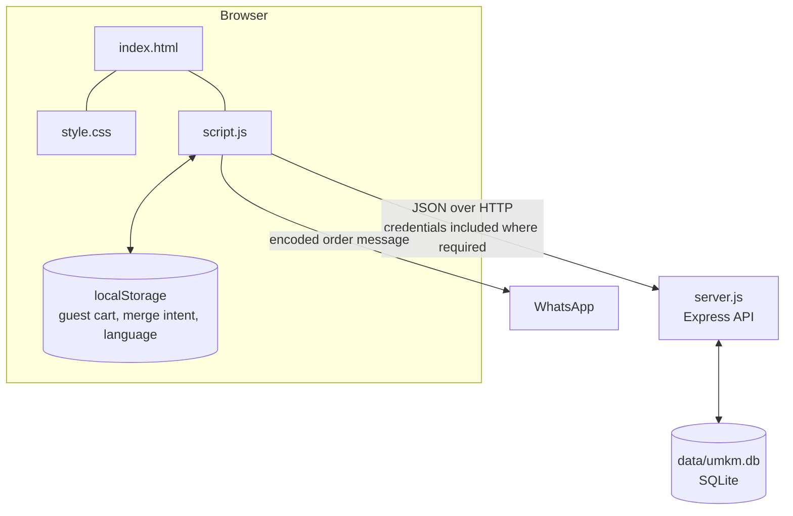
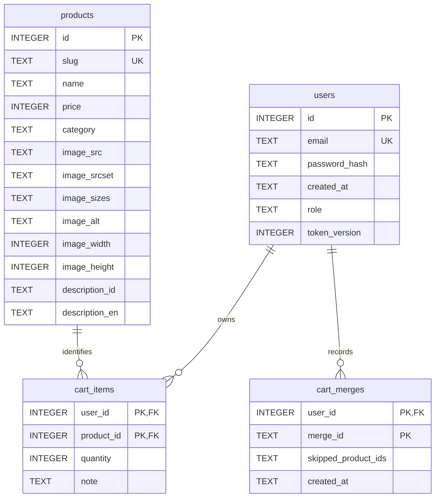
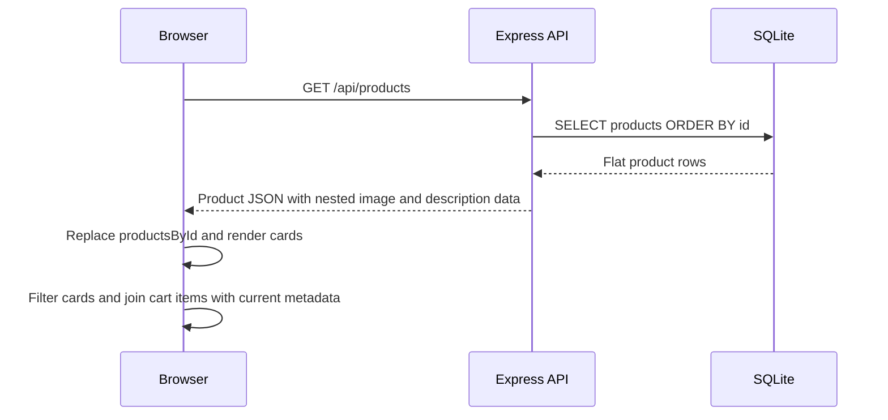
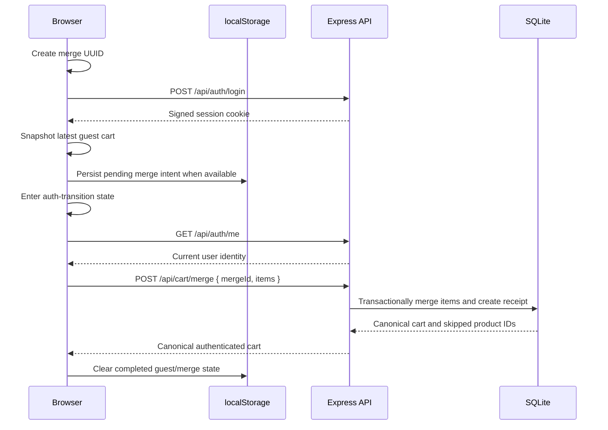

# Architecture

## Scope and system context

Sari Rasa currently consists of a static browser frontend, a Node.js/Express API, and a local SQLite database. It implements a bilingual product menu, cookie-based authentication, database-authoritative roles, product administration, guest and authenticated carts, and WhatsApp checkout handoff.

The data, machine-learning, deep-learning, and AI components described in the [roadmap](../ROADMAP.md) are future learning phases and are not present in the current runtime architecture. A Phase 4A Python foundation workspace exists in the repository (see [Python workspace](#python-workspace-phase-4a-foundation-not-a-running-service) below), but it is not a running service and has no runtime relationship to the application. The project is also not presented as a production deployment.

## Component overview

The browser is responsible for presentation, interaction, guest persistence, and temporary transition state. Express is the trust boundary for authentication, authorization, product mutations, and account cart ownership. SQLite is authoritative for products, users, authenticated cart items, and completed merge receipts.

## Frontend architecture

The frontend has no framework, bundler, or build step:

- `index.html` provides semantic page structure, dialogs, forms, navigation, and the static integration points used by JavaScript.
- `style.css` defines the responsive layout, component presentation, interaction states, and accessibility helpers.
- `script.js` contains rendering, translations, API communication, authentication state, cart state, and admin interactions.

### Products and rendering

On startup, `loadMenu()` requests `GET /api/products`. Successful responses replace `productsById`, a `Map` keyed by stable database product ID, and create the visible product cards. Product identity and cart calculations do not depend on card order or DOM position.

Category buttons filter rendered cards by their product category. Indonesian and English dictionaries provide interface text and fallbacks for the seeded product copy. The selected language is stored under `sari-rasa-lang` in `localStorage`.

### Authentication state

The browser does not store authenticated identity in `localStorage` and cannot read the HttpOnly session cookie. `checkAuthState()` calls `GET /api/auth/me` with `credentials: "include"`; the returned current user controls account and admin visibility. The backend remains authoritative for whether that user is authenticated or is an administrator.

### Cart state

One in-memory `Map` holds canonical cart items as `{ productId, quantity, note }`, while `cartAuthority` identifies which persistence model currently owns them:

- Guest items are stored in `localStorage` under `umkm-cart:v1`.
- Authenticated items are loaded from and written to the cart API.
- Transition/loading states temporarily block unsafe mutations and checkout.

Guest storage contains no product name, price, or totals. Rendering and WhatsApp message construction join cart items with current data in `productsById`, preventing stale stored metadata from becoming authoritative.

### Admin UI and API communication

The product dialog supports creation and full update; product cards expose edit/delete controls for a current admin. This visibility is a user-experience decision only. All product mutations still use credentialed API requests and are enforced by backend authorization.

The frontend API base URL is currently the constant `http://localhost:3000`. Browser authentication and cart requests use `credentials: "include"`. The product list itself is public and does not require credentials.

## Backend architecture

`server.js` defines the Express 5 application. It exports:

- `app`, allowing tests to import the configured application without automatically listening;
- `startServer(port)`, which supports an ephemeral port in tests; and
- `parseConfiguredPort(value)`, which validates the runtime port.

Running `node server.js` directly starts the server. The default port is 3000.

### Middleware and request handling

The application configures:

- CORS restricted to `http://localhost:5500`, with credential support;
- `express.json()` request parsing;
- `X-Content-Type-Options: nosniff`, `X-Frame-Options: DENY`, and `Referrer-Policy: no-referrer`;
- `requireAuth` for authenticated routes;
- `requireAdmin` after authentication for product mutations; and
- fixed-window, in-memory rate limiting for registration and login.

Unknown routes receive a JSON 404. The global error handler distinguishes malformed JSON from unexpected failures and returns generic server errors rather than exposing internal details.

### HTTP API

| Area | Routes | Authority |
|---|---|---|
| Health | `GET /api/health` | Public |
| Products | `GET /api/products`, `GET /api/products/:id` | Public |
| Product mutations | `POST /api/products`, `PUT /api/products/:id`, `DELETE /api/products/:id` | Authenticated admin |
| Authentication | `POST /api/auth/register`, `POST /api/auth/login` | Public, rate-limited |
| Authenticated identity | `GET /api/auth/me`, `POST /api/auth/logout` | Authenticated user |
| Cart | `GET /api/cart`, `PUT /api/cart/items/:productId`, `DELETE /api/cart/items/:productId`, `DELETE /api/cart` | Authenticated owner |
| Cart merge | `POST /api/cart/merge` | Authenticated owner |

Product handlers validate identifiers and request fields before using parameterized SQL. Cart handlers never accept a user ID as ownership authority; they derive it from `req.user.id`.

## Database architecture

`db/database.js` opens SQLite through `better-sqlite3`. Normal runtime defaults to `data/umkm.db`; `DATABASE_PATH` can select another path. Every connection enables and verifies SQLite foreign-key enforcement.

There is **no server-side session table**. The signed cookie carries the session payload, while protected requests validate it against the current `users` row and its `token_version`.

Important database rules include:

- unique product slugs and user emails;
- roles limited to `user` or `admin` on the supported schema;
- one cart item per `(user_id, product_id)`;
- integer cart quantities from 1 through 99;
- text notes no longer than 200 characters;
- product and user foreign keys with `ON DELETE CASCADE` for cart items;
- user deletion cascading to merge receipts; and
- one immutable merge receipt per `(user_id, merge_id)`.

Startup creates missing tables and performs narrowly supported, idempotent column evolution for role, token revocation, bilingual product descriptions, and skipped-product merge metadata. Eleven products are seeded only when the products table is empty. Description backfill does not overwrite rows whose descriptions have already been edited.

## Product data flow

SQLite stores image and description fields as columns. The API maps each row to the nested JSON shape consumed by `script.js`. The frontend then uses `productsById` for rendering, totals, cart details, edit forms, and WhatsApp checkout content.

## Authentication and session lifecycle

### Registration

The registration endpoint validates the submitted email and password, normalizes the email with trimming and lowercase conversion, hashes the password with bcrypt cost 12, and inserts only the email and password hash. The database default assigns role `user`; a registration request cannot self-assign `admin`.

### Login

Login normalizes the email and verifies the submitted password. A dummy bcrypt comparison also runs for unknown emails so that missing-user responses do not intentionally take a faster path. On success, the server signs a payload containing user ID, current token version, and issue time with HMAC-SHA256.

The cookie is:

- `HttpOnly`, so frontend JavaScript cannot read it;
- `SameSite=Lax`;
- `Secure` unless `NODE_ENV` is exactly `development`; and
- limited to the same 24-hour maximum age enforced inside the signed payload.

`SESSION_SECRET` must exist and contain at least 16 characters. A much longer random value is recommended because possession of this key permits session forgery.

### Session restoration and authorization

For every protected request, `requireAuth` parses and verifies the cookie, loads the current user from SQLite, compares the signed token version with the current database value, and attaches `{ id, email, role }` to `req.user`. `/api/auth/me` returns that current identity to the frontend.

This database lookup means role and token revocation state remain authoritative even when the browser holds an older signed cookie.

### Logout

Logout first increments the user's `token_version`, invalidating previously issued cookies for that account, and then clears the browser cookie with matching security attributes. A copied pre-logout cookie is rejected on subsequent protected requests.

## Guest-to-authenticated cart merge

Guest items use only `productId`, `quantity`, and `note`. Explicit login creates the merge UUID before sending credentials, then captures the latest guest-cart snapshot after login succeeds. When storage is available, that snapshot and UUID are retained as a pending intent so safe retry uses the same payload and identity. The cart enters its transition state before the subsequent auth check. Storage failure does not falsely claim durable reload recovery; the current page retains safe in-memory recovery state and keeps the transition locked when it cannot safely complete.

The server owns the target account through `req.user.id` and performs the merge in a SQLite transaction:

- a new product is inserted into the account cart;
- overlapping quantities are added and capped at 99;
- a non-empty guest note replaces the existing note;
- an empty guest note preserves the existing server note;
- products that no longer exist are skipped and reported; and
- the receipt key `(user_id, merge_id)` makes retries return the original result without reapplying changes.

The same merge UUID remains independent across different users because user ID is part of the receipt key. After success, the canonical server response becomes the browser's authenticated cart.

## Authenticated cart writer

Authenticated cart interactions update the in-memory model and UI immediately, then schedule persistence per product. The writer provides bounded coordination rather than a general offline-sync engine:

- one request for a product runs at a time;
- rapid changes coalesce toward the latest desired state;
- note writes use a 450 ms debounce;
- blur or change events flush pending note work;
- zero quantity uses the item DELETE route;
- failed writes trigger a canonical cart reload;
- cart epoch and authenticated-user checks prevent responses from an older context from replacing newer state; and
- logout enters a preparation state, flushes notes, and drains required writes before calling the logout API.

If reconciliation is incomplete or persistence remains unsafe, the frontend marks the cart unsynced and disables WhatsApp checkout. This avoids presenting an order handoff as safe after a failed authenticated write.

## Authorization and trust boundaries

The browser is not a security boundary. It hides admin controls for normal users, but a client can still construct arbitrary HTTP requests.

The backend therefore enforces the actual trust model:

- `requireAuth` derives identity from a valid signed cookie and a current database record;
- `requireAdmin` checks the current `req.user.role` after authentication;
- product creation, update, and deletion require an administrator;
- registration writes no role supplied by the client; and
- cart ownership always uses `req.user.id`, never a client-supplied user identifier.

SQLite constraints and foreign keys provide a second boundary for uniqueness, cart ranges, relationships, and cascade behavior.

## Security controls and limitations

Current controls include:

- bcrypt password hashing with cost 12;
- HMAC-SHA256 signed session cookies with a fail-loud secret requirement;
- HttpOnly, SameSite, Secure, and maximum-age cookie controls;
- current database role and token-version checks on protected requests;
- credentialed CORS restricted to `http://localhost:5500`;
- backend authentication and admin authorization middleware;
- parameterized SQL and request validation;
- generic unexpected-error responses;
- login and registration rate limiting;
- security response headers; and
- test-mode guards against direct, canonical, symlinked, or hard-linked access to the development database.

Relevant boundaries remain:

- the system is configured around local development;
- production-like browser authentication requires HTTPS because cookies remain Secure outside explicit development mode;
- rate-limit state is in process memory and resets on restart;
- there is no supported admin-provisioning workflow;
- there is no documented development-database reset, backup, or recovery command; and
- these controls are not a claim of complete production hardening.

## Testing architecture

### Backend and database suite

The backend suite uses Node's built-in `node:test` runner with test concurrency fixed to one. Each test file creates a temporary directory and SQLite database, sets an isolated environment, starts the imported application on an ephemeral port, and closes the server/database before removing its temporary resources and restoring environment variables.

Coverage includes products, authentication, signed-cookie behavior, session revocation, authorization, CORS, rate limiting, cart ownership, merge semantics and idempotency, schema constraints, cascades, supported schema evolution, startup idempotency, and seed-data preservation.

When `NODE_ENV=test`, startup requires `DATABASE_PATH`. Before opening SQLite, the database module rejects the normal development path, its canonical/symlink aliases, and existing files with the same device/inode identity, which also covers hard links.

### Frontend VM suite

The frontend suite reads the actual `script.js` source and executes it in `node:vm`. The harness supplies only the browser boundaries required by the tested behavior:

- a minimal fake DOM;
- localStorage-compatible storage with controllable failures;
- controlled fetch routing and manually ordered promises;
- a deterministic timeout scheduler; and
- fresh state for each scenario.

A small probe is appended to the loaded source **in memory** to observe selected lexical state and invoke production functions. The probe is never written into `script.js`, and production code exposes no test-only global.

### Integration contracts and verification baseline

Contract tests read the real files to verify that:

- every literal `getElementById` dependency in `script.js` exists exactly once in `index.html`;
- required class-based controls and the production script reference exist; and
- frontend API paths and methods correspond to Express routes.

The verified automated baseline is 30 backend tests plus 26 frontend tests, for 56 combined passing tests. Automated VM coverage is distinct from the user-performed Safari acceptance that validated real browser semantics and interaction.

## Key engineering decisions

### Vanilla frontend

HTML, CSS, and browser JavaScript keep DOM behavior, accessibility state, asynchronous control, and client-side data ownership explicit. This supports the project's frontend-learning goals without introducing framework abstractions.

### SQLite persistence

SQLite provides relational constraints, transactions, and durable local state with minimal operational overhead appropriate to the current local project scope.

### Signed-cookie authentication

The custom minimal session format demonstrates server-verifiable identity without exposing the cookie to frontend JavaScript. Database role and token-version lookups keep mutable authorization and revocation state authoritative.

### Separate guest and account carts

Browser storage allows useful anonymous shopping, while server-backed account carts provide authenticated persistence and ownership. The explicit transition prevents one authority from silently overwriting the other.

### Idempotent merge and coordinated writers

Merge receipts make guest-cart transfer retry-safe. Per-product serialization, coalescing, debounce, reconciliation, and epoch checks address the stale/out-of-order writes that arise once a cart persists asynchronously.

### Built-in testing tools

`node:test` and `node:vm` provide permanent behavioral coverage without adding a test framework or a second implementation of the frontend logic.

### Development-database protection

Tests fail before opening the real development database, including when a filesystem alias points to the same file. This turns preservation of developer-owned local state into an enforced invariant rather than a convention.

## Python workspace (local data foundation, not a running service)

Phase 4A introduced a repository-local Python workspace at `python/`, containing a small `sari_rasa_data` package and a pytest suite (`python/tests/`). Its modules are `foundation.py` (product/order validation, list/dict processing, function composition), `io_utils.py` (pathlib-based JSON file read/write), `__main__.py` (a small executable entry point), and the Phase 4B-1 `transactions.py` schema module. It is a local learning workspace: it is not started as a service, is not called by `server.js` or the browser, does not read `data/umkm.db`, and performs no filesystem access outside of tests' own temporary directories and files a caller explicitly passes in. It runs inside its own repository-local `.venv`, which is not committed.

This workspace has no runtime relationship to the component overview above. Current state is the existing Node/Express application plus this local Python foundation workspace, with no communication between them. Node.js/Express remains the only application-facing backend. Node → Python HTTP service integration, and the Python/FastAPI data-service architecture described in the [roadmap](../ROADMAP.md) for later Phase 4 subphases, are planning targets, not current behavior.

Phase 4B-1 adds `python/data/transactions.csv` as the canonical synthetic learning dataset and `sari_rasa_data.transactions` as its schema boundary. Each CSV row contains an order ID, ISO date, product ID and name, category, quantity, unit price, and payment method. The schema helper converts CSV-style date and integer strings into typed Python values and rejects missing or invalid required values. It does not load whole datasets, clean data, calculate analytics, access SQLite, or expose a service; those capabilities remain later roadmap work.

## Current boundaries and future scope

Current verified work includes the frontend foundation, Express API, SQLite-backed full-stack application, authentication, authorization, product administration, persistent carts, the automated regression foundation, the project documentation/runbook, the Phase 4A Python foundation workspace, and the Phase 4B-1 synthetic dataset/schema foundation. The Python workspace remains separate from the running application.

Python data handling, the Python/FastAPI data service, Node-to-Python integration, machine learning, deep-learning fundamentals, AI engineering, full-stack AI integration, and final deployment/portfolio engineering remain future phases. Their conceptual roadmap does not define current runtime components.

See the [Project Roadmap](../ROADMAP.md) for the approved sequence and current status.

For local installation, startup, testing, troubleshooting, and safe shutdown procedures, see the [Local Development Runbook](RUNBOOK.md).
