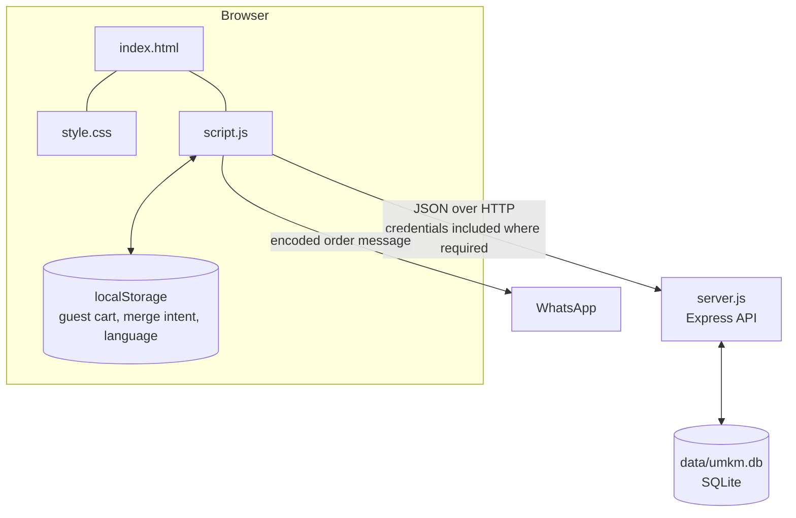
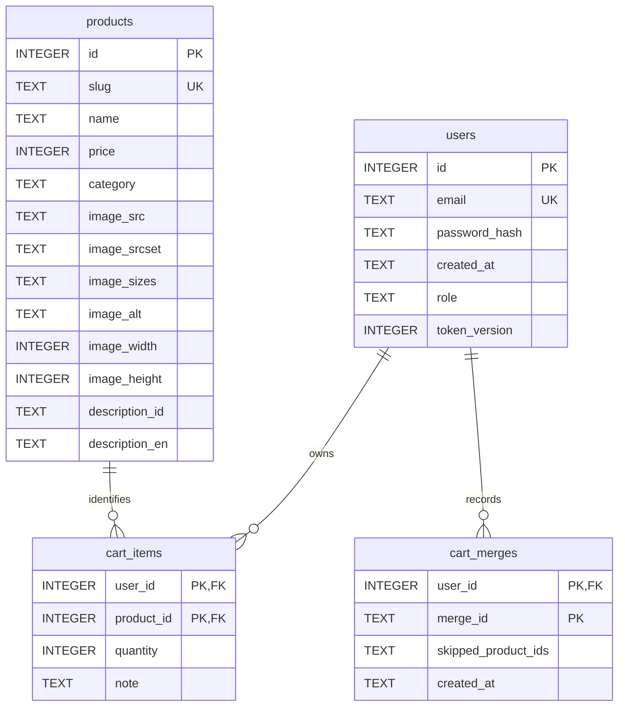
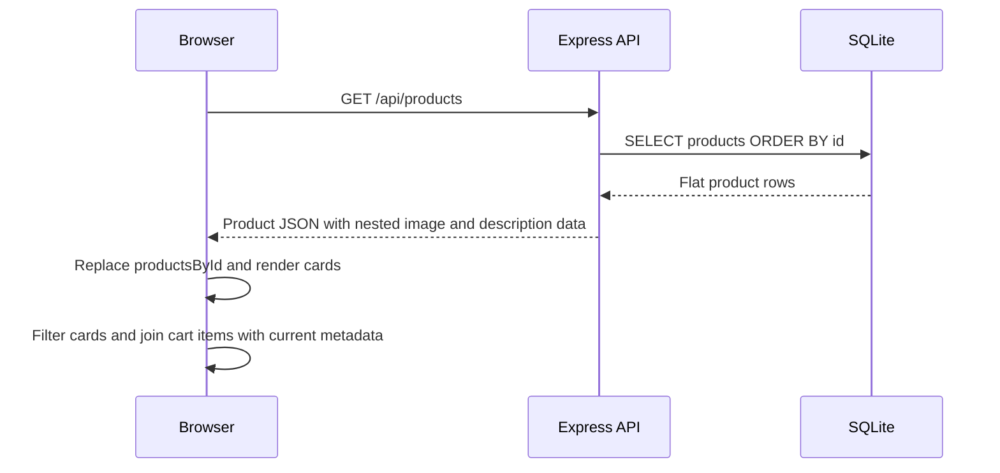
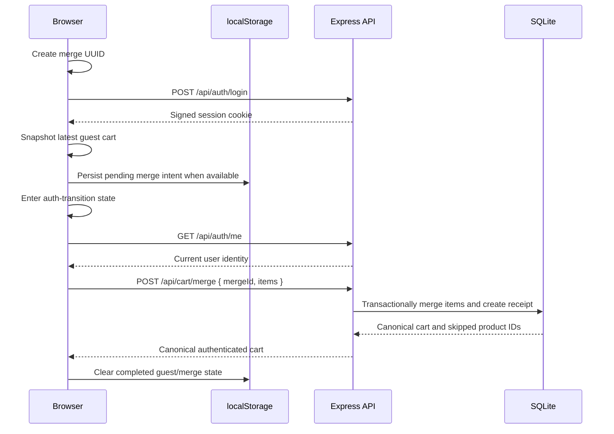

# Architecture

## Scope and system context

Sari Rasa currently consists of a static browser frontend, a Node.js/Express API, and a local SQLite database. It implements a bilingual product menu, cookie-based authentication, database-authoritative roles, product administration, guest and authenticated carts, and WhatsApp checkout handoff.

The machine-learning, deep-learning, and AI components described in the [roadmap](../ROADMAP.md) remain future learning phases. A local Python workspace and FastAPI data service now exist (see [Python workspace](#python-workspace-and-independent-data-service-foundation) below). Node/Express calls that service over server-to-server HTTP/JSON and remains the only application-facing backend; the browser does not call FastAPI directly. The project is also not presented as a production deployment.

## Component overview



The browser is responsible for presentation, interaction, guest persistence, and temporary transition state. Express is the trust boundary for authentication, authorization, product mutations, and account cart ownership. SQLite is authoritative for products, users, authenticated cart items, and completed merge receipts.

## Frontend architecture

The frontend has no framework, bundler, or build step:

- `index.html` provides semantic page structure, dialogs, forms, navigation, and the static integration points used by JavaScript.
- `style.css` defines the responsive layout, component presentation, interaction states, and accessibility helpers.
- `script.js` contains rendering, translations, API communication, authentication state, cart state, and admin interactions.

### Products and rendering

On startup, `loadMenu()` requests `GET /api/products`. Successful responses replace `productsById`, a `Map` keyed by stable database product ID, and create the visible product cards. Product identity and cart calculations do not depend on card order or DOM position.

Category buttons filter rendered cards by their product category. Indonesian and English dictionaries provide interface text and fallbacks for the seeded product copy. The selected language is stored under `sari-rasa-lang` in `localStorage`.

### Authentication state

The browser does not store authenticated identity in `localStorage` and cannot read the HttpOnly session cookie. `checkAuthState()` calls `GET /api/auth/me` with `credentials: "include"`; the returned current user controls account and admin visibility. The backend remains authoritative for whether that user is authenticated or is an administrator.

### Cart state

One in-memory `Map` holds canonical cart items as `{ productId, quantity, note }`, while `cartAuthority` identifies which persistence model currently owns them:

- Guest items are stored in `localStorage` under `umkm-cart:v1`.
- Authenticated items are loaded from and written to the cart API.
- Transition/loading states temporarily block unsafe mutations and checkout.

Guest storage contains no product name, price, or totals. Rendering and WhatsApp message construction join cart items with current data in `productsById`, preventing stale stored metadata from becoming authoritative.

### Admin UI and API communication

The product dialog supports creation and full update; product cards expose edit/delete controls for a current admin. This visibility is a user-experience decision only. All product mutations still use credentialed API requests and are enforced by backend authorization.

The frontend API base URL is currently the constant `http://localhost:3000`. Browser authentication and cart requests use `credentials: "include"`. The product list itself is public and does not require credentials.

## Backend architecture

`server.js` defines the Express 5 application. It exports:

- `app`, allowing tests to import the configured application without automatically listening;
- `startServer(port)`, which supports an ephemeral port in tests; and
- `parseConfiguredPort(value)`, which validates the runtime port.

Running `node server.js` directly starts the server. The default port is 3000.

### Middleware and request handling

The application configures:

- CORS restricted to `http://localhost:5500`, with credential support;
- `express.json()` request parsing;
- `X-Content-Type-Options: nosniff`, `X-Frame-Options: DENY`, and `Referrer-Policy: no-referrer`;
- `requireAuth` for authenticated routes;
- `requireAdmin` after authentication for product mutations; and
- fixed-window, in-memory rate limiting for registration and login.

Unknown routes receive a JSON 404. The global error handler distinguishes malformed JSON from unexpected failures and returns generic server errors rather than exposing internal details.

### HTTP API

| Area | Routes | Authority |
|---|---|---|
| Health | `GET /api/health` | Public |
| Products | `GET /api/products`, `GET /api/products/:id` | Public |
| Product mutations | `POST /api/products`, `PUT /api/products/:id`, `DELETE /api/products/:id` | Authenticated admin |
| Authentication | `POST /api/auth/register`, `POST /api/auth/login` | Public, rate-limited |
| Authenticated identity | `GET /api/auth/me`, `POST /api/auth/logout` | Authenticated user |
| Cart | `GET /api/cart`, `PUT /api/cart/items/:productId`, `DELETE /api/cart/items/:productId`, `DELETE /api/cart` | Authenticated owner |
| Cart merge | `POST /api/cart/merge` | Authenticated owner |

Product handlers validate identifiers and request fields before using parameterized SQL. Cart handlers never accept a user ID as ownership authority; they derive it from `req.user.id`.

## Database architecture

`db/database.js` opens SQLite through `better-sqlite3`. Normal runtime defaults to `data/umkm.db`; `DATABASE_PATH` can select another path. Every connection enables and verifies SQLite foreign-key enforcement.

There is **no server-side session table**. The signed cookie carries the session payload, while protected requests validate it against the current `users` row and its `token_version`.



Important database rules include:

- unique product slugs and user emails;
- roles limited to `user` or `admin` on the supported schema;
- one cart item per `(user_id, product_id)`;
- integer cart quantities from 1 through 99;
- text notes no longer than 200 characters;
- product and user foreign keys with `ON DELETE CASCADE` for cart items;
- user deletion cascading to merge receipts; and
- one immutable merge receipt per `(user_id, merge_id)`.

Startup creates missing tables and performs narrowly supported, idempotent column evolution for role, token revocation, bilingual product descriptions, and skipped-product merge metadata. Eleven products are seeded only when the products table is empty. Description backfill does not overwrite rows whose descriptions have already been edited.

## Product data flow



SQLite stores image and description fields as columns. The API maps each row to the nested JSON shape consumed by `script.js`. The frontend then uses `productsById` for rendering, totals, cart details, edit forms, and WhatsApp checkout content.

## Authentication and session lifecycle

### Registration

The registration endpoint validates the submitted email and password, normalizes the email with trimming and lowercase conversion, hashes the password with bcrypt cost 12, and inserts only the email and password hash. The database default assigns role `user`; a registration request cannot self-assign `admin`.

### Login

Login normalizes the email and verifies the submitted password. A dummy bcrypt comparison also runs for unknown emails so that missing-user responses do not intentionally take a faster path. On success, the server signs a payload containing user ID, current token version, and issue time with HMAC-SHA256.

The cookie is:

- `HttpOnly`, so frontend JavaScript cannot read it;
- `SameSite=Lax`;
- `Secure` unless `NODE_ENV` is exactly `development`; and
- limited to the same 24-hour maximum age enforced inside the signed payload.

`SESSION_SECRET` must exist and contain at least 16 characters. A much longer random value is recommended because possession of this key permits session forgery.

### Session restoration and authorization

For every protected request, `requireAuth` parses and verifies the cookie, loads the current user from SQLite, compares the signed token version with the current database value, and attaches `{ id, email, role }` to `req.user`. `/api/auth/me` returns that current identity to the frontend.

This database lookup means role and token revocation state remain authoritative even when the browser holds an older signed cookie.

### Logout

Logout first increments the user's `token_version`, invalidating previously issued cookies for that account, and then clears the browser cookie with matching security attributes. A copied pre-logout cookie is rejected on subsequent protected requests.

## Guest-to-authenticated cart merge



Guest items use only `productId`, `quantity`, and `note`. Explicit login creates the merge UUID before sending credentials, then captures the latest guest-cart snapshot after login succeeds. When storage is available, that snapshot and UUID are retained as a pending intent so safe retry uses the same payload and identity. The cart enters its transition state before the subsequent auth check. Storage failure does not falsely claim durable reload recovery; the current page retains safe in-memory recovery state and keeps the transition locked when it cannot safely complete.

The server owns the target account through `req.user.id` and performs the merge in a SQLite transaction:

- a new product is inserted into the account cart;
- overlapping quantities are added and capped at 99;
- a non-empty guest note replaces the existing note;
- an empty guest note preserves the existing server note;
- products that no longer exist are skipped and reported; and
- the receipt key `(user_id, merge_id)` makes retries return the original result without reapplying changes.

The same merge UUID remains independent across different users because user ID is part of the receipt key. After success, the canonical server response becomes the browser's authenticated cart.

## Authenticated cart writer

Authenticated cart interactions update the in-memory model and UI immediately, then schedule persistence per product. The writer provides bounded coordination rather than a general offline-sync engine:

- one request for a product runs at a time;
- rapid changes coalesce toward the latest desired state;
- note writes use a 450 ms debounce;
- blur or change events flush pending note work;
- zero quantity uses the item DELETE route;
- failed writes trigger a canonical cart reload;
- cart epoch and authenticated-user checks prevent responses from an older context from replacing newer state; and
- logout enters a preparation state, flushes notes, and drains required writes before calling the logout API.

If reconciliation is incomplete or persistence remains unsafe, the frontend marks the cart unsynced and disables WhatsApp checkout. This avoids presenting an order handoff as safe after a failed authenticated write.

## Authorization and trust boundaries

The browser is not a security boundary. It hides admin controls for normal users, but a client can still construct arbitrary HTTP requests.

The backend therefore enforces the actual trust model:

- `requireAuth` derives identity from a valid signed cookie and a current database record;
- `requireAdmin` checks the current `req.user.role` after authentication;
- product creation, update, and deletion require an administrator;
- registration writes no role supplied by the client; and
- cart ownership always uses `req.user.id`, never a client-supplied user identifier.

SQLite constraints and foreign keys provide a second boundary for uniqueness, cart ranges, relationships, and cascade behavior.

## Security controls and limitations

Current controls include:

- bcrypt password hashing with cost 12;
- HMAC-SHA256 signed session cookies with a fail-loud secret requirement;
- HttpOnly, SameSite, Secure, and maximum-age cookie controls;
- current database role and token-version checks on protected requests;
- credentialed CORS restricted to `http://localhost:5500`;
- backend authentication and admin authorization middleware;
- parameterized SQL and request validation;
- generic unexpected-error responses;
- login and registration rate limiting;
- security response headers; and
- test-mode guards against direct, canonical, symlinked, or hard-linked access to the development database.

Relevant boundaries remain:

- the system is configured around local development;
- production-like browser authentication requires HTTPS because cookies remain Secure outside explicit development mode;
- rate-limit state is in process memory and resets on restart;
- there is no supported admin-provisioning workflow;
- there is no documented development-database reset, backup, or recovery command; and
- these controls are not a claim of complete production hardening.

## Testing architecture

### Backend and database suite

The backend suite uses Node's built-in `node:test` runner with test concurrency fixed to one. Each test file creates a temporary directory and SQLite database, sets an isolated environment, starts the imported application on an ephemeral port, and closes the server/database before removing its temporary resources and restoring environment variables.

Coverage includes products, authentication, signed-cookie behavior, session revocation, authorization, CORS, rate limiting, cart ownership, merge semantics and idempotency, schema constraints, cascades, supported schema evolution, startup idempotency, and seed-data preservation.

When `NODE_ENV=test`, startup requires `DATABASE_PATH`. Before opening SQLite, the database module rejects the normal development path, its canonical/symlink aliases, and existing files with the same device/inode identity, which also covers hard links.

### Frontend VM suite

The frontend suite reads the actual `script.js` source and executes it in `node:vm`. The harness supplies only the browser boundaries required by the tested behavior:

- a minimal fake DOM;
- localStorage-compatible storage with controllable failures;
- controlled fetch routing and manually ordered promises;
- a deterministic timeout scheduler; and
- fresh state for each scenario.

A small probe is appended to the loaded source **in memory** to observe selected lexical state and invoke production functions. The probe is never written into `script.js`, and production code exposes no test-only global.

### Integration contracts and verification baseline

Contract tests read the real files to verify that:

- every literal `getElementById` dependency in `script.js` exists exactly once in `index.html`;
- required class-based controls and the production script reference exist; and
- frontend API paths and methods correspond to Express routes.

The current automated baseline is 32 backend tests plus 57 frontend tests, for 89 combined Node tests, alongside 228 Python tests. Automated VM coverage is distinct from user-performed browser acceptance, which validated real responsive, keyboard, chart, calendar, global-filter, and failure/recovery behavior.

## Key engineering decisions

### Vanilla frontend

HTML, CSS, and browser JavaScript keep DOM behavior, accessibility state, asynchronous control, and client-side data ownership explicit. This supports the project's frontend-learning goals without introducing framework abstractions.

### SQLite persistence

SQLite provides relational constraints, transactions, and durable local state with minimal operational overhead appropriate to the current local project scope.

### Signed-cookie authentication

The custom minimal session format demonstrates server-verifiable identity without exposing the cookie to frontend JavaScript. Database role and token-version lookups keep mutable authorization and revocation state authoritative.

### Separate guest and account carts

Browser storage allows useful anonymous shopping, while server-backed account carts provide authenticated persistence and ownership. The explicit transition prevents one authority from silently overwriting the other.

### Idempotent merge and coordinated writers

Merge receipts make guest-cart transfer retry-safe. Per-product serialization, coalescing, debounce, reconciliation, and epoch checks address the stale/out-of-order writes that arise once a cart persists asynchronously.

### Built-in testing tools

`node:test` and `node:vm` provide permanent behavioral coverage without adding a test framework or a second implementation of the frontend logic.

### Development-database protection

Tests fail before opening the real development database, including when a filesystem alias points to the same file. This turns preservation of developer-owned local state into an enforced invariant rather than a convention.

## Python workspace and independent data-service foundation

Phase 4A introduced a repository-local Python workspace at `python/`, containing a small `sari_rasa_data` package and a pytest suite (`python/tests/`). Its modules include the Phase 4A foundations, Phase 4B transaction pipeline, Phase 4C Pandas/NumPy analysis, and the Phase 4D `service.py` FastAPI boundary. The service exposes health, compact summary, product, and category endpoints. Importing the application performs no analysis; each analytics endpoint loads and analyzes the canonical CSV only when requested. The workspace runs inside its own repository-local `.venv`, which is not committed.

The FastAPI process is a separately started specialized service. Node.js/Express remains the only application-facing backend and delegates its four `/api/analytics/*` routes through `lib/pythonAnalyticsClient.js` to the matching FastAPI analytics routes. All four accept the same optional, inclusive `start_date` and `end_date` query parameters; omitted dates retain the full-dataset contract. Sales Trend also returns dataset-derived `min_available_date` and `max_available_date`, which bound the frontend calendar without hardcoded dataset dates. `PYTHON_SERVICE_URL` is trusted server-operator configuration, never request/frontend input; callers cannot choose arbitrary upstream paths. The client uses built-in Node `fetch`, exact contracts, and a three-second timeout. Errors remain controlled and redacted. There are no retries, background polling, or direct browser-to-Python requests. Each dashboard section has an independent status/cache while sharing one applied period.

```text
Admin Analytics browser UI
    ↓
Node / Express
    ├── GET /api/analytics/summary?start_date=&end_date=
    ├── GET /api/analytics/products?start_date=&end_date=
    ├── GET /api/analytics/categories?start_date=&end_date=
    └── GET /api/analytics/sales-trend?start_date=&end_date=
            ↓ built-in fetch, HTTP/JSON, 3-second timeout
        Python FastAPI service
```

Expected dataset, validation, and analytics failures are translated at the route boundary into stable endpoint-specific HTTP 500 details. Internal exception text, filesystem paths, Pandas diagnostics, and implementation details are not returned to clients. The health route remains independent of analytics and data access.

```text
Python service process
    ├── GET /health → {"status":"ok"} (no data access)
    ├── GET /analytics/summary?start_date=&end_date=
    ├── GET /analytics/products?start_date=&end_date=
    ├── GET /analytics/categories?start_date=&end_date=
    └── GET /analytics/sales-trend?start_date=&end_date=
            ↓
        canonical transactions.csv
            ↓
        Phase 4B/4C load and analytics functions
            ↓
        JSON-safe summary, product, and category results

No SQLite, Node, browser, or transactions_large.csv dependency
```

Phase 4B-1 adds `python/data/transactions.csv` as the canonical synthetic learning dataset and `sari_rasa_data.transactions` as its schema boundary. Each CSV row contains an order ID, ISO date, product ID and name, category, quantity, unit price, and payment method. The schema helper converts CSV-style date and integer strings into typed Python values and rejects missing or invalid required values. It does not load whole datasets, clean data, calculate analytics, access SQLite, or expose a service; those capabilities remain later roadmap work.

Phase 4B-2 adds `sari_rasa_data.data_loader` with separate CSV and JSON file entry points. Both loaders send each record through `parse_transaction_row`, producing the same JSON-compatible dictionary shape with an ISO date string and integer quantity/unit price:

```text
CSV / JSON
    ↓
standard-library loader
    ↓
shared transaction normalization and validation
    ↓
validated JSON-compatible dictionaries
```

The loaders fail on malformed input rather than silently skipping records.

Phase 4B-3 adds `sari_rasa_data.data_transform` for transaction-level cleaning and transformation:

```text
CSV / JSON
    ↓
standard-library loader
    ↓
shared transaction normalization and validation
    ↓
known category/payment normalization
    ↓
line_total transformation
    ↓
validated JSON-compatible dictionaries
```

Cleaning trims text through the shared parser and normalizes only known category and payment-method case variants. Unknown values and invalid dates, quantities, or prices still fail rather than being repaired silently. Transformation adds only `line_total = quantity * unit_price`, returns new dictionaries, and preserves batch order.

Phase 4B-4 completes the plain-Python baseline with dataset-level aggregation over transformed transaction lines:

```text
Synthetic CSV
    ↓
CSV / JSON loader
    ↓
shared validation
    ↓
cleaning
    ↓
transaction transformation
    ↓
pure-Python aggregation
    ↓
JSON-compatible results
```

The Phase 4B aggregation boundary sums line revenue and quantity and groups them by category, product, or ISO date. It does not count transaction rows as unique customer orders. At that checkpoint there was no average-order calculation, ranking, statistics, visualization, database access, network communication, or service; later Phase 4C work builds on this pure-Python baseline.

Phase 4C-1 reuses the Phase 4B pipeline rather than bypassing its rules:

```text
Synthetic CSV
    ↓
Phase 4B load / validate / clean / transform
    ↓
validated transaction records
    ↓
Pandas DataFrame
```

The DataFrame bridge preserves the nine transaction columns, numeric values, input order, and JSON-compatible record conversion. Phase 4C-2 extends that boundary with Pandas filtering, `groupby` sums, and deterministic product-quantity sorting:

```text
Synthetic CSV
    ↓
Phase 4B pipeline
    ↓
Pandas DataFrame
    ↓
filter / groupby / sum / sort
    ↓
JSON-compatible analysis results
```

These operations reproduce the equivalent Phase 4B totals without replacing its validation path. Phase 4C-3 adds explicit NumPy analysis over the same Pandas columns:

```text
Synthetic CSV
    ↓
Phase 4B pipeline
    ↓
Pandas DataFrame
    ↓
selected numeric columns (quantity, unit_price, line_total)
    ↓
NumPy arrays
    ↓
basic statistics (mean, median, min, max, population std, percentiles)
```

`numpy_analysis.column_to_numpy` copies one approved numeric column into a new `numpy.ndarray` without mutating the source DataFrame. `mean_value`, `median_value`, `min_value`, `max_value`, `standard_deviation`, and `percentile_value` return plain Python floats (never NumPy scalar types), and each raises `ValueError` on an empty array instead of silently returning NumPy's NaN. `standard_deviation` uses population semantics (`numpy.std` default, ddof=0), and `percentile_value` validates its percentile argument is between 0 and 100 inclusive. `summarize_numeric_column` composes these into one JSON-compatible dictionary. Pandas remains responsible for tabular representation, filtering, and grouping; NumPy is used only for numeric arrays and statistics over columns Pandas already produced.

### Phase 4C-4 — large synthetic dataset and integrated analysis

Two transaction datasets now exist with clearly separated responsibilities:

| Dataset | Path | Rows | Purpose |
|---|---|---|---|
| Canonical regression fixture | `python/data/transactions.csv` | 30 | small, human-inspectable, used by the Phase 4B/4C-1/4C-2/4C-3 regression tests; never modified by Phase 4C-4 |
| Large synthetic analysis dataset | `python/data/transactions_large.csv` | 10,000 | generated on demand for meaningful Pandas + NumPy analysis; not committed to Git in this phase |

`sari_rasa_data.synthetic_data` generates the large dataset from a single `random.Random(seed)` instance (`DEFAULT_SEED = 20260901`, `DEFAULT_ROW_COUNT = 10_000`), so the same seed and row count always reproduce byte-identical output. It reuses the exact Phase 4B schema fields and deliberately omits `line_total`, which stays a value derived by the Phase 4B transform step rather than raw input. Multiple transaction lines can share one `order_id`, modeling a single order containing several products. The generator encodes moderate, explainable patterns — higher weekend demand, per-month seasonal multipliers (a December peak), per-product popularity weights, a QRIS-leaning payment-method mix, and a small share of bulk-quantity lines — without hard-coding the resulting analysis numbers.

```text
Synthetic CSV (transactions_large.csv)
    ↓
Phase 4B pipeline (load / validate / clean / transform)
    ↓
Pandas DataFrame
    ↓
Pandas analysis (filter / groupby / rank)
    ↓
NumPy statistics
    ↓
JSON-compatible integrated summary
```

`sari_rasa_data.analysis_pipeline` composes the existing Phase 4B/4C-1/4C-2/4C-3 functions — it does not reimplement loading, filtering, grouping, or statistics. It adds only the metrics those modules did not already provide: unique-order counting, order-level average order value (`total_revenue / unique_order_count`, not divided by transaction-line count), an ISO date range, monthly revenue, a weekday/weekend comparison, and payment-method transaction-line counts (documented as line counts, not order counts, since `payment_method` is recorded per transaction line). `analyze_transactions(path)` returns one dictionary of only plain `dict`/`list`/`str`/`int`/`float` values suitable for `json.dumps`.

### Phase 5B — forecasting dataset and feature boundary

Phase 5B adds a third, generated-only dataset with a distinct responsibility:

| Dataset | Path | Default horizon | Purpose |
|---|---|---|---|
| ML development dataset | `python/data/transactions_ml.csv` | 2024-01-01 through 2025-12-31 | deterministic next-day quantity feature development; ignored by Git and regenerated from source |

`sari_rasa_data.ml_synthetic_data` generates transactions chronologically from moderate product/category popularity, day-of-week and month effects, gradual growth, autoregressive continuity, deterministic promotion windows, modest product-mix evolution, and seeded noise. It uses the shared transaction schema but never replaces the canonical analytics fixture or the Phase 4 large integration dataset. The CSV contains no future target or engineered feature columns.

`sari_rasa_data.forecasting` provides the preparation boundary:

```text
Generated transaction rows
    ↓ shared Phase 4 validation/transformation
Continuous daily quantity series (missing dates = 0)
    ↓ next-day alignment
Calendar + lag + shifted rolling features
    ↓ deterministic chronological slicing
Train / validation / untouched test DataFrames
```

Each supervised row uses `date` as its information cutoff and `forecast_date` as the next-day target date. `lag_1_quantity` is the known cutoff-day quantity; lag 7 and lag 14 are aligned relative to the target day. Rolling 7/28-day statistics apply an explicit one-day shift before rolling, so they exclude both the next-day target and the cutoff-day value. The cutoff value is available only through lag 1. Initial rows without 28 prior days and the final row without a next-day target are dropped rather than imputed. Splitting preserves chronological order and creates no overlapping forecast dates. Phase 5B performs no model fitting, scoring, persistence, serving, Node integration, or UI work.

### Phase 5C — validation baseline boundary

`sari_rasa_data.baseline_forecasting` establishes model-independent benchmarks without adding scikit-learn. Previous-day and previous-week predictions map directly to `lag_1_quantity` and `lag_7_quantity`. The approved trailing-seven-day baseline is calculated against the continuous daily series from forecast date minus seven through forecast date minus one, so it includes the known origin-day quantity and never includes the forecast-date actual. It intentionally does not reuse the Phase 5B `rolling_mean_7` model feature, whose shifted window ends one day earlier.

```text
Continuous daily series + supervised frame
    ↓ chronological split
Validation frame only (105 rows)
    ├── previous-day prediction
    ├── previous-week prediction
    └── trailing-seven-day mean prediction
            ↓
       MAE / RMSE ranking
            ↓
Previous-week baseline selected for Phase 5D comparison

Final test frame (106 rows) ── untouched in Phase 5C
```

The evaluation function accepts an explicitly supplied validation frame and has no test-frame parameter or test-evaluation path. MAE is the primary selection metric and RMSE is secondary. Metric helpers reject invalid shapes, empty input, length mismatch, non-finite values, and arithmetic overflow. This phase selects no trained model and creates no artifact, service endpoint, Node route, or browser feature.

### Phase 5D — classical model selection and final evaluation boundary

`sari_rasa_data.model_training` consumes the existing supervised frame through a strict feature allowlist. `date`, `forecast_date`, and `target_next_day_quantity` never enter `X`; the target is separated as `y`. Ridge candidates wrap `StandardScaler` and `Ridge` in one scikit-learn `Pipeline`, so scaling is fitted on the same permitted partition as the estimator. HistGradientBoosting candidates use fixed configurations, disabled early stopping, and a fixed random state.

```text
TRAIN (491)
    ↓ fit 5 Ridge + 3 HistGradientBoosting candidates
VALIDATION (105)
    ↓ MAE-primary selection + descriptive permutation importance
Frozen winning specification
    ↓ refit preprocessing/model on TRAIN + VALIDATION only
TEST (106)
    ↓ one issued-selection evaluation
Final model and previous-week baseline metrics + diagnostics
```

Selection accepts no TEST argument. Shared partition validation rejects missing, duplicate, unsorted, reversed, or overlapping forecast dates. The previous-week validation benchmark is recomputed from the supplied validation target and lag-7 values rather than trusted as a stale constant. A selected configuration carries an opaque process-local token; final evaluation validates its provenance, ranked winner, and estimator family, then consumes the token immediately before its first TEST feature/target access. The same issued selection cannot evaluate TEST twice in that process. This technical gate complements the procedural rule that TEST results are not used for retuning across process restarts.

The final policy is **refit after selection**: rebuild the frozen winning specification, fit all preprocessing and the estimator on combined TRAIN+VALIDATION, then predict TEST once. The returned prediction frame supports one diagnostic pass without another model call. No result is fed back into candidate choice. Validation permutation importance is a lightweight description of predictive associations on the same validation data used for selection; it is not a causal claim or independent generalization estimate.

Phase 5D's evaluation record remains unchanged and unbiased. Phase 5E subsequently refits the exact frozen specification on all available supervised history for deployment usefulness.

### Phase 5E — trusted artifact and prediction service boundary

```text
Generated ML transactions (2024-01-01…2025-12-31)
    ↓ shared daily aggregation and Phase 5B feature engineering
All available supervised rows (forecast dates 2024-01-30…2025-12-31)
    ↓ frozen Phase 5D HistGradientBoosting specification; no retuning
python/models/next_day_quantity_v1.joblib (generated, Git-ignored)
    ↓ fixed operator-controlled path + strict metadata/type validation
GET /analytics/forecast/next-day
```

The schema `1.0` artifact is a joblib dictionary containing `metadata` and the fitted `model`. Metadata records the exact ordered features, target, one-day horizon, model family and hyperparameters, training dates/policy, generator identity and seed, model random state, and Python/scikit-learn versions. Loading fails closed on missing, corrupt, structurally invalid, wrong-version, wrong-family, wrong-feature, wrong-target/horizon/policy, or wrong-estimator artifacts.

Joblib uses executable pickle deserialization. The model path is therefore trusted operator configuration only (`SARI_RASA_MODEL_ARTIFACT_PATH`, with a repository-local default), never an API parameter or upload. The separate ML source is likewise operator configuration (`SARI_RASA_ML_DATASET_PATH`) and defaults to the generated ML-development CSV. Existing analytics continue using only the small canonical CSV.

Inference takes transaction history, creates a continuous daily series (missing calendar days become zero), and calls the shared Phase 5B feature builder. It requires at least 29 continuous days and rejects invalid, duplicate, unsorted, non-finite, negative, or fractional daily quantities. The response preserves the finite floating-point regression output without rounding or clamping. Missing/incompatible artifacts and invalid internal source data produce a redacted HTTP 503. The service never trains during import, startup, or a request.

### Phase 5F — Node forecast gateway boundary

```text
Browser / API consumer
    ↓ GET /api/analytics/forecast/next-day
Node/Express gateway
    ↓ trusted PYTHON_SERVICE_URL; GET; 3000 ms; no retries
FastAPI GET /analytics/forecast/next-day
    ↓
Trusted local joblib artifact + ML history
```

`lib/pythonAnalyticsClient.js` owns the shared Node-to-Python URL validation, built-in `fetch`, `AbortController`, timeout cleanup, and failure classification. Its forecast client accepts only the exact schema: a real ISO calendar date, finite numeric prediction, model family `hist_gradient_boosting`, artifact schema `1.0`, and integer one-day horizon. Extra fields, coercible strings, malformed JSON, non-2xx responses, and unsupported model metadata are rejected rather than proxied.

The Express route accepts no query parameters and cannot receive an upstream URL, artifact path, dataset path, model family, or version override. It matches the existing read-only analytics API authorization behavior; those Node analytics routes are not guarded by admin middleware, while the current dashboard remains admin-only in the browser. Timeouts map to a redacted 504; network, upstream non-2xx, JSON, and contract failures map to a redacted 502. Python bodies, exception messages, filesystem paths, and service topology are never returned. The browser still never calls FastAPI directly, and Phase 5F adds no frontend rendering.

### Phase 5F-R — V2 experiment and serving refinement

V1 remains historical verified evidence with its original two-year dataset, selected parameters, metrics, and `next_day_quantity_v1.joblib`. V2 is separate:

```text
11-product application/database seed catalog
    ↓ deterministic V2 generation (seed 20260902)
transactions_ml_v2.csv: 750,000 transaction rows / 693 days / 11 products
    ↓ chunked validation + daily quantity aggregation
664 next-day supervised observations; unchanged ten features
    ↓ TRAIN 479 → VALIDATION 92; TEST 93 isolated
8 predefined classical candidates → frozen V2 winner
    ↓ one TEST evaluation, then serving refit on all 664 rows
next_day_quantity_v2.joblib
    ↓ FastAPI /analytics/forecast/next-day
Node /api/analytics/forecast/next-day
```

The V2 generator streams rows rather than building a 750K-dictionary collection. It includes synthetic weekday/month/growth/event/spike, correlated-noise, order-size, quantity, payment, and evolving product-popularity assumptions; these are simulation choices, not claims about measured Indonesian consumer behavior. No event flag enters the model. Artifact schema remains `1.0`, while metadata identifies experiment `2.0`, dataset SHA-256, 750K transaction rows, 664 daily supervised rows, dates, seed, and frozen parameters. The trusted joblib boundary and external response remain unchanged.

### Phase 4G-R2 — shared V2 analytics snapshot

```text
trusted SARI_RASA_ANALYTICS_DATASET_PATH
    ↓ default: transactions_ml_v2.csv; exact identity verification
vectorized validation + one transient 750K DataFrame
    ↓ compact and release raw frame
daily (693) + daily-product (7,623) + daily-category (2,079)
    ↓ arbitrary inclusive date masks and compact aggregates
FastAPI → Node/Express → existing Phase 4 dashboard
```

The in-process cache key combines resolved trusted path with device, inode, size, and nanosecond mtime. Unchanged requests reuse one immutable aggregate snapshot. File replacement, regeneration, modification, or operator path change triggers a locked reload; a failed reload never installs an invalid snapshot. The configured V2 default additionally verifies 750,000 rows, exact date boundaries, and SHA-256. Dataset paths never come from HTTP input.

Only aggregate JSON leaves FastAPI. Full Sales Trend is 693 daily points (~62 KB), not 750K rows. The transient raw frame is released after producing 693 daily, 7,623 daily-product, and 2,079 daily-category rows. Current 11-product measurements remain about 2.3 seconds cold, milliseconds warm, and 2.305 seconds through Node for a cold trend, so Node retains its three-second timeout. Existing frontend SVG/calendar/race-handling code is unchanged; 5F-R2 manual browser acceptance passed with exactly the 11 application products visible in Product Performance and stable repeated navigation.

The pre-4G-R2 analytics pipeline fully reloaded and validated the CSV for each calculation, taking about seven seconds per V2 request. Phase 4G-R2 replaces that repeated-load path with the shared compact snapshot above. Runtime dashboard analytics now default to V2; the canonical small fixture remains available explicitly for deterministic tests. Raw V2 rows are never returned to Node or the browser.

## Current boundaries and future scope

Current verified work includes the frontend foundation, Express API, SQLite-backed full-stack application, authentication, authorization, product administration, persistent carts, the automated regression foundation, the project documentation/runbook, the Phase 4A Python foundation workspace, the complete Phase 4B pure-Python pipeline, and the complete Phase 4C Pandas/NumPy analysis (4C-1 through 4C-4). Phase 4D-1 through 4D-4 and Phase 4D as a whole are verified complete after hardening, automated verification, documentation, independent review, and final user manual acceptance. The Python service remains a separately started process and is now integrated behind Node's Phase 4E analytics routes.

Phase 4E Node-to-Python integration, Phase 4F, and Phase 4 are verified complete. The approved post-quality-gate Phase 4G extension, including 4G-R2 browser acceptance, is also verified complete. Phase 5A through Phase 5F, 5F-R, and 5F-R2 are verified complete; 5F-R2 aligns the shared V2 source and artifact to the 11-product catalog, with automated verification, independent review, and browser acceptance passed. Forecast dashboard UI remains unimplemented; Phase 5G is next.

See the [Project Roadmap](../ROADMAP.md) for the approved sequence and current status.

For local installation, startup, testing, troubleshooting, and safe shutdown procedures, see the [Local Development Runbook](RUNBOOK.md).
